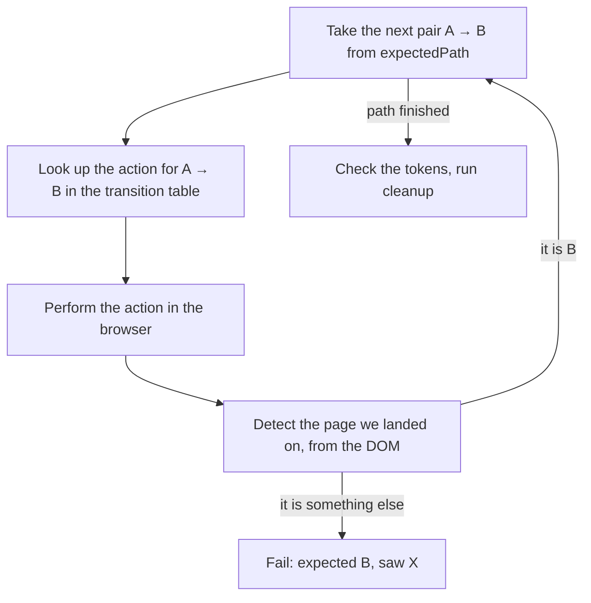

# Testing the Identity Platform — Proposal

This is a proposal: what we want to build, why we need it, and how we would
use it. The point of this document is to agree on the approach before we
invest in it. You can read it in ten minutes.

## Why we need this

The Identity Platform is not a single product. It is a composition of
services: Kratos, Hydra, the login UI, and a set of optional services around
them. What a user actually experiences depends on configuration. Is MFA
enforced? Are local passwords enabled? How many external OIDC providers are
wired in? Is WebAuthn a second factor, or a step-up after OIDC? Are access
tokens JWTs or opaque? Which optional services are deployed at all?

Each service has tests in its own repo. Nothing tests the composition. And
the composition is where the interesting bugs live: almost every defect we
have seen so far is two correctly-behaving services interacting badly, under
a configuration that no test environment happened to have.

The example that started this: a login bug that only appears when a
deployment offers exactly one first-factor method. None of our environments
had that shape, so no amount of extra test writing against them could have
caught it. We were not missing tests. We were missing configurations.

We propose a repo with three jobs:

1. Deploy the platform in a chosen configuration, and prove the running
   deployment actually matches that choice.
2. Drive real browser journeys and Go E2E tests through it, deterministically.
3. Make both cheap enough that we can do it for many configurations, not just
   the two or three we happen to like.

It builds nothing. Every service under test runs from a published image or a
store charm, so a fresh clone needs nothing beside Docker (or a Juju
controller, for the charmed lane).

## Feature set

What we are proposing to build:

- A browser suite where each test is a small data object describing a user
  journey. A generic runner executes them all.
- Deterministic test users: a seeder creates the same identities before every
  run and writes a manifest the tests read. Tests never touch admin APIs.
- Assertions on the tokens the relying party receives, not only on the pages
  the user saw.
- Coverage of weird-but-normal user behaviour (reload, double-click,
  back/forward, replaying a URL), declared on top of existing journeys.
- A model of every configuration option an operator can set, and a generated
  matrix of deployments that covers every pair of settings.
- Deployment verification: before any test runs, a preflight proves the
  running stack matches the configuration we asked for. Mismatch means
  "refuse to test", never "test whatever is up".
- One test contract that runs against four kinds of target: local Docker
  Compose, a fresh Juju deployment, an existing Juju deployment we do not
  own, or just a set of URLs.
- A CI gate with hard rules: zero retries, no flaky tags, and every skip must
  name a missing capability.
- Go suites for smoke and API-level integration checks.

## How a test would work: scenarios and transitions

A scenario is data, not code. It says who the user is, which pages they
should pass through, and what must be true at the end:

```ts
{
  id: "first-login-mfa",
  description: "First-time login with MFA — user must set up TOTP",
  requires: { mfaEnabled: true, localUsersEnabled: true },
  user: { ref: "first-mfa", credentials: ["password"], totpConfigured: false },
  expectedPath: [
    "login-email",
    "login-password",
    "setup-secure",
    "setup-complete",
    "oidc-callback",
  ],
  cleanup: "remove-totp",
}
```

The runner walks `expectedPath` in pairs. For each pair "A → B" it looks up,
in one shared transition table, the action that takes a user from A to B
("type the password, press Sign in"). It performs that action in the browser,
then reads the DOM to decide which page it actually landed on. If that is B,
it continues. If it is anything else, the test fails and says what it saw.



A few details would make this solid:

- Page detection is DOM-based, not URL-based. The login UI shows many
  different states on the same URL, so we look at what is actually rendered.
- The transition table also declares which moves are legal at all. A scenario
  with an impossible path fails when the suite loads, before any browser
  starts.
- `requires` gates each scenario on the deployment's declared capabilities.
  On a deployment without MFA, the scenario above skips, and the skip reason
  names the capability. That is the only kind of skip we would allow.
- Error cases are scenarios too. Their path simply stays on the same page
  ("submit a wrong password, still on login-password"), and the runner then
  also demands a visible error message. "Did not navigate" alone would let a
  swallowed submit pass.

### Where users come from

The `user` block in the example deserves a closer look, because it does not
create anything and it contains no credentials. `ref` is just a name. It
points into a catalogue of user archetypes that the suite maintains: "a
password user with no second factor yet", "a user already enrolled in TOTP",
"a user who signs in through an external provider", "a user down to their
last few backup codes", and so on. Scenarios share these archetypes; many
journeys reuse the same one.

Before every run, a seeder reads that catalogue and creates the real
identities through the admin APIs, then writes a manifest: the actual
emails, passwords and TOTP secrets the run will use. At runtime, a scenario
resolves its `ref` against the manifest. The tests themselves never touch an
admin API.

The rest of the `user` block (`credentials`, `totpConfigured`) declares the
starting state the journey needs. In the example above: this user can log in
with a password and has no TOTP yet — which is exactly why the path goes
through the TOTP setup pages.

A few rules keep this honest:

- The catalogue is the only place users are defined. A scenario naming a
  `ref` the catalogue does not know fails loudly at seed time, so adding a
  journey can never invent a user by accident.
- A scenario that permanently changes its user (the example enrols TOTP)
  must declare a cleanup that works even when the test failed halfway. On
  top of that, the gate re-seeds before every run — so every run starts from
  the same set of users, and running the suite twice really is the same
  experiment twice.
- One deliberate exception: security keys cannot be pre-created through an
  API, so WebAuthn scenarios register their key inside the journey itself.

### The scenario fields

The example above shows about half of the model. The full shape we propose:

| Field | What it declares |
|---|---|
| `id`, `description` | a unique name and one line of intent |
| `requires` | the deployment capabilities the journey needs; when they are not met the scenario skips, and the skip names the capability |
| `user` | which archetype to use, and the starting state it must be in (see above) |
| `expectedPath` | the ordered list of pages the user passes through |
| `phases` | for journeys with more than one visit: several paths run in the same browser, each with its own parameters |
| `freshSession` | start a phase with cookies cleared — the platform sees a returning browser with no session ("come back the next day") |
| `flowParams` | extra parameters on the OIDC request: force re-authentication, or send a deliberately broken request to test the error pages |
| `expectError` | for error scenarios, where the path stays on the same page: a visible error message is required — "did not navigate" is not enough |
| `finalUrlContains` | what the final URL must contain, e.g. an exact error code |
| `interventions` | the perturbations described in the next section, anchored to this path |
| `postChecks` | named API-side checks that run after the walk |
| `assertions` | what the issued tokens must, and must not, contain: group claims, tenant claims, or a custom check |
| `cleanup` | a named undo action for scenarios that permanently change their user; runs even when the test failed |
| `lanes` | where the scenario may run: the full internal lane, the restricted live lane, or both |

Between them, these fields cover every journey that is a line: log in,
register, recover a password, verify an email, enrol a second factor, go
through an external provider, hit an error and stay put, come back the next
day and be remembered. What they deliberately do not cover is journeys that
are not a line — two browsers racing over the same recovery code, say. Those
few stay hand-written specs, and they should remain the rare exception.

The payoff: adding coverage means adding a data object. Reviewing a test
means reading a path and a set of claims, not pages of Playwright code. And
every scenario automatically works on every deployment configuration, because
the runner and the gating are shared.

## Weird user behaviour: interventions

Real users reload, double-click, press Back, and paste old URLs. Kratos and
Hydra both have dedicated machinery for handling this, and nothing we run
today exercises any of it.

We do not want a second copy of every scenario with "...but reload in the
middle". Instead, a scenario should be able to declare interventions: small
named perturbations anchored to the path it already has:

```ts
expectedPath: ["login-email", "login-password", "login-totp-verify", "oidc-callback"],
interventions: [
  { at: "login-password", do: "reload" },
  { on: "login-totp-verify → oidc-callback", do: "double-submit" },
],
```

Four primitives would cover most of it:

- `reload` — press F5 once we reach a state. The same page must come back,
  and the walk must still finish.
- `double-submit` — submit a form twice, fast. The flow must not process it
  twice.
- `history-back` / `history-roundtrip` — real browser Back (and Forward),
  either at the end of a journey or as a round-trip in the middle. The
  re-rendered page must still be live, not a cached corpse.
- `replay-current-url` — re-navigate to the current URL at the end of the
  walk. The obvious use: replaying the OIDC callback re-sends the
  authorization code, and that must fail.

Interventions fit the model because they reuse what the scenario already
declares. An anchor must name a state or transition on the scenario's own
path, so a typo fails at load time instead of silently never firing. The
happy path stays readable, and each perturbation is a one-line annotation
rather than a new test.

Some outcomes are invisible in the browser. A replayed authorization code
must also revoke the tokens from the original exchange, and no page will ever
show that. For those cases a scenario names a post-check: an API-side
verification that runs after the walk, against the tokens the relying party
actually received. Same principle throughout: scenarios name checks, they
never implement them.

## Deployments: the matrix

We would write down, as a machine-readable model, every configuration
dimension an operator can actually set: local users, MFA, email verification,
WebAuthn mode, number of external OIDC providers, presence of each optional
service, JWT vs opaque tokens. Every dimension is backed by a real charm
option, so the model describes deployments operators can produce, not
arbitrary combinations of environment variables.

From that model, a generator derives concrete deployments, called rows:

- Three pinned rows become our standing profiles — the ones the CI gate runs.
- Shapes that have bitten us before become seed rows. They stay forever, as
  regression sentinels.
- Generated rows fill the rest of the space, so every achievable pair of
  settings is deployed by at least one row.

A row materializes as a compose override plus a declared capabilities file,
and the same row also renders as terraform variables for the charmed backend.
One model, several substrates.

Every row runs the same contract:

```
deploy → verify → seed → test → verdict
```

Verify is the step that matters most. Before a single test runs, a preflight
checks that the running deployment matches the row's declaration on three
levels: the substrate (compose environment, or juju config and relations),
live behaviour (which login methods the stack actually offers, what shape of
token it actually mints), and the product's own config report. Any mismatch
aborts the run: "deployment does not match declaration — refusing to test".

This closes the failure mode we should be most afraid of. Which scenarios run
is decided by the declared capabilities, never by discovering whatever
happens to be up. So a reconfiguration that silently did not land cannot
shrink a 30-test run into a 5-test green run; it aborts instead. After the
run, the executed set is compared with the expected set in both directions —
a test that skipped when it should have run fails the row even if everything
that ran was green.

The same contract would run against four kinds of target:

| Backend | What it is for |
|---|---|
| compose | local dev and the CI gate |
| juju | a clean charmed deployment |
| juju attach | an existing deployment (dev/stg); its plan-only variant is a pure drift check, zero mutation |
| urls | any live deployment; needs the login URL and nothing else |

## The gate

One command, `make gate PROFILE=<name>`, becomes the blocking contract. It
typechecks the suite, brings the profile up, runs a smoke check, then runs
the browser suite twice with a fresh seed before each run, then the Go E2E
suite. It fails on:

- any test failure;
- any flake — the two runs exist to catch them, and retries are 0 everywhere;
- any skip that does not name a missing capability;
- the two runs executing different sets of tests;
- the collected test list drifting from a checked-in expected list, so a
  spec that silently stops being collected cannot look like green.

A second command, `make gate-all-profiles`, adds one more rule: the union of
tests executed across all profiles must cover every test in the suite. A
profile may skip what it cannot deploy, but a test that skips everywhere is
dead weight pretending to be coverage. Genuinely blocked tests go into a
short checked-in list, each with a reason and an unblock condition, and the
check also fails if one of them starts running again.

Determinism rules apply everywhere, with no exceptions: one worker, zero
retries, no flaky or quarantine tags, a fresh seed before every run, and
cleanup declared by every scenario that mutates a shared user.

## How we would use it in CI

| When | What | Blocking |
|---|---|---|
| every PR | `make gate PROFILE=<name>`, one job per profile | yes |
| nightly | `make test-matrix` — every seed and generated row | no — failures become filed findings, not red PRs |
| shared dev/stg | attach mode, plan-only — "does this deployment still match its declared shape?" | drift alarm |
| any live deployment | urls backend, live lane | on demand |

The three profile gates are independent stacks, so they parallelize naturally
as separate CI jobs. The matrix lane is deliberately non-blocking: its job is
to find configuration-interaction bugs, and a red row is a finding to file,
not a reason to block an unrelated PR.

## The proposed architecture

| Piece | Role |
|---|---|
| `tests/browser/scenarios/` | the tests: journey data objects |
| `tests/browser/framework/` | the engine: runner, transition table, interventions, claim assertions |
| `tests/browser/helpers/` | page-state detection and small utilities |
| `tests/browser/seeder/` | the only code allowed to call admin APIs; seeds users, writes the manifest |
| `tests/browser/specs/` | thin entry points that hand scenarios to the runner |
| `tests/e2e/` | Go suites: smoke and integration |
| `docker/` | the compose stack, in layers: infra / auth / services |
| `matrix/` | the config model, the row generator, the deployment verifier, the row runner |
| `matrix/rows/` | generated — one directory per deployment configuration |
| `matrix/backends/juju/` | terraform for the charmed backend |

Two separations would carry most of the weight:

- **Seeder vs tests.** Tests never call admin APIs; they read a manifest the
  seeder wrote. This is what makes it safe to point the suite at a deployment
  where we have no admin access: the UI-only subset still runs.
- **Data vs engine.** Scenarios, the transition table and the config model
  are data. The runner, the detection code and the verifier are the engine,
  and the engine stays small. Most changes to the suite should never touch it.

## Why tests should run one at a time

We propose running the browser suite with a single worker, and we expect this
to be questioned, so here is the reasoning.

All tests share one stack, and Kratos identities and sessions are global
state inside it. Two tests logging in as the same user at the same time
invalidate each other's sessions. Several scenarios also mutate their user —
enrol TOTP, change a password — and clean up afterwards. Interleave those and
a failure stops meaning "the product broke" and starts meaning "the tests
raced". The whole design buys one property: red means a real bug. Parallel
workers inside one stack would sell that property back for a few minutes of
runtime.

Should they ever run in parallel? Inside one stack, not until the runtime
actually hurts. The parallelism that pays is one level up: profiles and
matrix rows are independent stacks, so CI runs them side by side as separate
jobs, and that scales with runners instead of with luck. If a single
profile's suite ever grows painful, the clean path is per-worker user sets —
each worker gets its own seeded identities, so nothing is shared. The seeder
design allows for that later. We should pay that complexity when the runtime
justifies it, not before.

## Testing live environments

Compose proves the logic. It does not prove the deployment. A real
environment adds everything the local stack hides: real TLS and certificate
chains, a real domain (WebAuthn credentials are bound to it), a real ingress,
the configuration a charm actually rendered, real email delivery.

The suite should therefore be designed, from the start, to be pointed at
environments we do not own:

- The **live lane** runs the UI-only subset: no admin APIs, no email
  dependencies, no seeding. Safe against a real deployment.
- The **urls backend** runs the full row contract with nothing but URLs — no
  cluster credentials at all. TLS verification stays on there: a certificate
  we cannot verify is a finding, not noise.
- **Attach mode** brings an existing charmed deployment to a declared shape,
  and its plan-only variant answers "has this deployment drifted?" without
  changing anything.

### The Google problem

Some of our real deployments authenticate against Google, so we want at least
one journey that goes through the real Google login. A short spike confirmed
it can be automated end to end, TOTP included. But everything about it is
hostile to CI:

- Google refuses automated browsers outright ("This browser or app may not be
  secure"). The spike got through with the real Chrome binary, a normal user
  agent and the automation flag disabled. That works today and can stop
  working any day Google decides so.
- It needs a real Workspace account: email, password and the TOTP secret,
  delivered to the test as secrets. That is a credential-management problem,
  and those values can never live in the repo.
- Consumer accounts trigger reCAPTCHA. Workspace accounts from a stable IP do
  not — but CI runners come from datacenter IP ranges that Google may treat
  very differently.
- Repeated automated logins risk rate limiting and account lockout.
- Google's sign-in UI changes without notice and varies by account and
  region, so selectors rot on Google's schedule, not ours.

So Google journeys should be opt-in: they run only when credentials are
provided, and they do not belong in the blocking gate. In the gate, the
external-provider role is played by Dex — a provider we run ourselves, which
behaves the same on every run. Google coverage becomes a periodic, supervised
check against the environments that actually use it.

## Extending it

- **New user journey** → add a scenario object. If it needs a new kind of
  user, add an archetype to the seeder. No engine changes.
- **New weird behaviour** → add one intervention primitive, then declare it
  on any number of existing scenarios.
- **New token or claim check** → add a named assertion; scenarios reference
  it by name.
- **New configuration option** → add a dimension to the model and regenerate
  the matrix. New rows appear; existing rows stay stable.
- **New deployment target** → implement the backend contract (deploy and
  verify); scenarios, seeding and gating are reused as they are.

The common thread: the extension points are data. The engine changes rarely,
and when it does, one change upgrades every test at once.

## What this buys us

- Coverage of configuration interactions that no per-service suite and no
  manual test plan reaches.
- Tests a reviewer can actually review: a path and a set of claims.
- A signal we can trust: no retries and no quarantine means green is green,
  and red is a bug — in the product or in the deployment, and the preflight
  tells us which.
- One suite for every environment we care about: a laptop, CI, a charmed
  cluster, a shared staging deployment, or just a URL.
