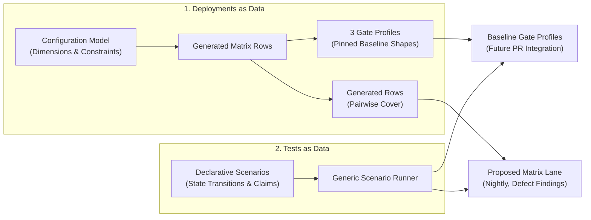
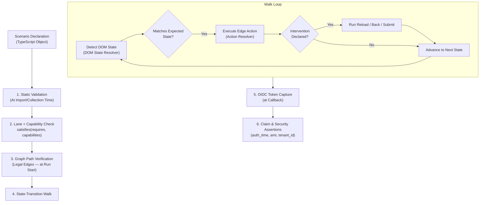

# Identity Platform — Browser & E2E Testing Architecture Proposal

> **Status:** Accepted. This is the review-facing RFC for the architecture — narrative and rationale, no contracts. [`docs/testing-spec.md`](testing-spec.md) is authoritative where they disagree.

## Abstract

The Canonical Identity Platform is a **composition of microservices** (Kratos, Hydra, Login UI, Traefik, Tenant Service, Hook Service, User Verification) rather than a single monolith. What a user experiences depends heavily on four variables:
1. **Deployed Services:** Which optional microservices are present.
2. **Platform Configuration:** MFA enforcement, WebAuthn settings, OIDC providers, token formats.
3. **Identity Credentials:** Password, WebAuthn key, TOTP, external IdP links.
4. **Entry Point:** Direct login, OIDC authorization flow, multi-tenant selection, self-service.

Defects in the platform almost always occur at **component interaction boundaries** under specific configuration combinations (e.g., a bug appearing only when exactly one OIDC provider is configured without local passwords).

To catch these issues reliably without maintaining thousands of lines of fragile, imperative Playwright UI scripts, **we propose a model-driven, declarative testing architecture**:



---

## Core Architectural Pillars

### 1. Tests as Data (Declarative Scenarios)
We suggest defining browser tests as **declarative JavaScript/TypeScript data objects** rather than imperative Playwright code. Under this proposal, a scenario declares:
- **Prerequisites:** What deployment capabilities are required (`requires`).
- **User Archetype:** Which seeded test user to act as (`user.ref`).
- **Expected Path:** The logical sequence of UI states to walk (`expectedPath`).
- **Interventions:** Edge-case disruptions (reloads, history back/forward, double submits).
- **Assertions:** Security and token claim verifications (`auth_time`, `amr`, tenant IDs).

A single **generic scenario runner** interprets these objects, resolves state-to-state UI transitions, and executes the walk. Adding test coverage simply means adding a data object.

### 2. Deployments as Data (Configuration Matrix)
Instead of testing against a single static environment, we propose defining a machine-readable configuration model (the matrix model) representing the **operator-producible configuration space**:
- **Dimensions:** MFA rules, OIDC providers, WebAuthn modes, active microservices, token types.
- **Constraints:** Rules preventing invalid deployment permutations.
- **Pairwise Cover:** A greedy algorithm generates minimal deployment "rows" that cover all reachable two-way configuration pairs (~11 rows total vs. 400+ valid permutations).

### 3. Proposed Anti-Silent-Shrink Contract
To ensure test runs never quietly skip tests when a deployment fails to reconfigure:
- **Gating by Declaration:** Scenarios execute based on what the deployment *should* be (`capabilities.json`), not what it claims to discover at runtime.
- **Preflight Verification:** Before any browser runs, a 3-layer preflight check validates the running stack against the declared capabilities:
  1. *Substrate check:* Docker container flags or Juju relation/config status.
  2. *Behavioral probes:* Real API/flow checks (e.g., verifying AAL1 vs AAL2 session enforcement, token minting shape).
  3. *Self-report:* Service app-config checks.
- Any mismatch aborts immediately rather than silently running fewer tests.

### 4. Non-Negotiable Determinism Rules
We propose strict determinism rules to eliminate test flakiness:
- **`retries: 0` everywhere:** A test that passes on retry is treated as a failure.
- **Single Worker (`workers: 1`):** Prevents session and identity state collisions across concurrent runs.
- **Deterministic Re-Seeding:** Test identities and tenants are re-seeded before every run.
- **Capability-Based Skips:** Every skip explicitly names a missing deployment capability. Flaky tags or quarantine lists do not exist.

**Why a single worker.** All tests share one stack, and Kratos identities and sessions are global state inside it. Two tests logging in as the same user at the same time invalidate each other's sessions; several scenarios also mutate their user (enrol TOTP, change a password) and clean up afterwards. Interleave those and a failure stops meaning "the product broke" and starts meaning "the tests raced". The whole design buys one property — red means a real bug — and parallel workers inside one stack would sell it back for a few minutes of runtime. The parallelism that pays is one level up: profiles and matrix rows are independent stacks, so CI runs them side by side as separate jobs, which scales with runners instead of with luck. If a single profile's suite ever grows painful, the clean path is per-worker user sets — each worker gets its own seeded identities, so nothing is shared — and the seeder design allows for that later. We pay that complexity when the runtime justifies it, not before.

---

## Proposed Dual Testing Lanes

We suggest splitting the testing workflow into two distinct lanes:

| Feature | Baseline Gate Profiles (Future PR Integration) | Proposed Matrix Lane (Nightly / Async) |
|---|---|---|
| **Purpose** | Validate baseline core profiles (candidate for future PR gate) | Discover edge-case bugs across configuration shapes |
| **Execution** | Scheduled / On-demand (future work: per-PR blocking gate) | Scheduled / Nightly (non-blocking) |
| **Deployments** | 3 pinned baseline profiles (`core`, `canonical-internal`, `canonical-portal`) | Full pairwise generated matrix (~11 rows) |
| **Strictness** | Must pass twice consecutively with identical executed sets | Red rows produce named defect findings for product teams |

### Baseline Profiles (Future Gate Candidates)
1. **`core`:** Minimum baseline — Local IdP, no MFA, no extra microservices.
2. **`canonical-internal`:** Single-tenant internal platform — Enforced MFA, WebAuthn sequencing, Hook Service, User Verification.
3. **`canonical-portal`:** Multi-tenant portal — Enforced MFA (TOTP/Backup codes), Tenant Service enabled.

---

## Proposed Scenario & Runner Architecture

The core proposal for the browser suite is treating user journeys as walks through a **finite state machine**.



### 1. Proposed Scenario Anatomy
A scenario defines a journey end-to-end without UI implementation details:

```typescript
export const loginScenarios = defineScenarioSuite({
  name: "login",
  defaultLanes: ["live", "internal"],
  scenarios: [
    defineScenario({
      id: "login-carries-group-claim",
      description:
        "A user in a hook-service group receives that group in both the access and ID token",
      requires: { mfaEnabled: true, multiTenancy: false, localUsersEnabled: true, hookService: true },
      user: { ref: "returning-mfa", credentials: ["password", "totp"], totpConfigured: true },
      expectedPath: [
        "login-email",
        "login-password",
        "login-totp-verify",
        "oidc-callback",
      ],
      assertions: { noTenantId: true, groups: ["platform-testers"] },
    }),
  ],
});
```

`assertions` is an **object** of named checks, not a tagged
array, and `user.ref` must name a real archetype
(`no-mfa`, `first-mfa`, `returning-mfa`, `dex-user`, `multi-tenant-user`, …).
Both are validated at import, so a wrong shape fails collection.

Key fields proposed:
- `id`: Unique scenario identifier — also the test name and the unit the
  expected-set check counts.
- `requires`: Capability predicate (e.g. `multiTenancy: true`, `mfaEnabled: true`).
- `user.ref`: Symbolic identity reference from the seeder's archetype definitions.
- `expectedPath`: Ordered sequence of logical UI states.
- `expectError`: Asserts that self-transitions (e.g., `login-password → login-password`) render visible validation error messages.
- `interventions`: Declarative UI perturbations anchored to specific states or transitions.
- `assertions`: An object of named token checks evaluated at the callback —
  `noTenantId`, `tenantIdFromSeed`, `groups`, `noGroups`, and `custom` for
  composed claim assertions such as `allOf(reauthenticated(0, 1), amrRecords({ mustInclude: ["totp"] }))`.

### 2. DOM-Driven State Detection
Because the Login UI multiplexes many logical authentication states onto a few shared URLs, we rely on **DOM markers** rather than URL paths. The runner detects states based on visible form elements, input names, and headings rather than brittle URL paths alone.

#### Supported State Vocabulary

| Category | States | Key Signals |
|---|---|---|
| **Authentication & MFA** | `login-email`, `login-password`, `login-totp-verify`, `login-webauthn-verify`, `login-backup-code-verify` | Form inputs, TOTP/WebAuthn/backup code UI elements |
| **Multi-Tenancy** | `tenant-selection` | Tenant selection heading and tenant options |
| **Registration & Verification** | `register-email`, `register-password`, `register-secure`, `register-complete`, `setup-secure`, `setup-backup-codes`, `setup-complete`, `verification` | Registration steps, MFA enrollment elements, verification code input |
| **Self-Service & Recovery** | `reset-email`, `reset-email-code`, `reset-password`, `backup-code-regenerate` | Password reset inputs, code entry fields, recovery prompts |
| **Device Authorization** *(staged)* | `device-code`, `device-complete` | User code input field, success confirmation title |
| **Protocol Terminals** | `oidc-callback`, `consent`, `error-page`, `oidc-error-page` | OAuth2 redirect parameters, consent forms, error pages |
| **External IdPs** | `provider:dex:*`, `provider:google:*` | Provider-specific URLs and DOM element signatures |
### 3. Transition Actions
The scenario runner executes steps by looking up pairwise transitions in a centralized action table:
- `"login-email → login-password"` → type the email, click Continue.
- `"login-password → oidc-callback"` → type the password, click Sign In.

### 4. Interventions (Resilience Testing)
To test browser resilience declaratively, scenarios could include interventions anchored to path states:
- **`reload`**: Refreshes the page (`F5`) mid-flow to verify state persistence.
- **`double-submit`**: Fires fast consecutive form submits to catch race conditions.
- **`history-roundtrip`**: Triggers Browser Back, verifies previous state, triggers Browser Forward, and continues the walk.
- **`replay-current-url`**: Re-navigates to the current URL at flow terminals.
- **`resend-code`**: Clicks resend on code forms, asserting cooldown countdown and rate limiting.
- **`back-forward-switch`**: Navigates Back across method-switch steps, then Forward to resume.
- **`concurrent-session-revoke`**: Revokes active session via admin API mid-walk before submitting.
- **`expired-token-submit`**: Submits after flow expiry to assert terminal error handling.

### 5. Deep Token & Claim Assertions
To prove security invariants beyond page navigation, the runner captures both ID and Access Tokens at `oidc-callback` to evaluate claim assertions:
- **`auth_time` Advancement:** Verifies that forced re-authentication actually issued a fresh `auth_time` timestamp.
- **`amr` (Authentication Method Reference):** Asserts exact authentication factors (e.g., verifying TOTP vs. WebAuthn factor recording).
- **Tenant & Group Claims:** Verifies custom claims injected by Hook Service or Tenant Service.

---

## Proposed Configuration Surface & Matrix Generation

We propose modeling **9 operational dimensions** derived directly from charm configuration options:

| Dimension | Options | Description |
|---|---|---|
| `local_idp` | `on`, `off` | Password authentication, email verification, self-service recovery |
| `mfa` | `enforced`, `off` | TOTP & Backup code enforcement |
| `verification` | `on`, `off` | Email address verification requirements |
| `webauthn` | `none`, `sequencing`, (`passwordless`*) | Hardware security key step-up rules |
| `providers` | `0`, `1`, `2` | External OIDC providers (Integrator apps / Google / Dex) |
| `tenant_service` | `present`, `absent` | Multi-tenancy support |
| `hook_service` | `present`, `absent` | Token claim enrichment hook |
| `user_verification` | `present`, `absent` | Webhook user approval checks |
| `access_token` | `jwt`, `opaque` | Relying party token representation |

Using greedy pairwise coverage, **155 reachable configuration pairs** across 280
valid combinations are covered using just **11 rows** (3 pinned gate profiles + 3
permanent regression seeds + 5 generated pairwise rows). The number that
motivates the whole exercise: the 3 pinned profiles on their own cover only
**68 of the 155 pairs (43.9%)**. Opaque access tokens are modelled but never
paired with a present add-on: both add-on admin APIs parse bearer tokens as
JWTs only, so the combination cannot be administered or seeded (spec §3 ‡).

\* `passwordless` (passkeys as the first factor) is modelled but retired from
generation by constraint — it is not actively maintained upstream and the
charm-rendered shape rejects webauthn-1FA flow creation. The dimension still
documents the charm option.
Device authorization (`device_flow`) and account linking (`account_linking`) are committed coverage additions specified in `docs/testing-spec.md` §10 items 10 and 15.

---

## Proposed Deployment Substrates & Execution Modes

We propose standardizing tests across five deployment interfaces, ensuring the same preflight and gating contract holds whether testing locally or against live infrastructure:

### 1. Docker Compose (`--backend=compose`)
- **Primary Use:** Local developer feedback and baseline profile validation (future work: PR blocking gate).
- **Mechanics:** Brings up container layers (`infra`, `auth`, `services`) with compose overrides. Cheap to reconfigure during matrix generation.
- **Contract:** Re-seeds deterministic test state before every run, executes the 3-layer preflight, and enforces strict zero-retry determinism.

### 2. Juju Clean Deploy (`--backend=juju`)
- **Primary Use:** Full platform validation on Charmed Kubernetes (MicroK8s).
- **Mechanics:** Applies row configurations as Terraform variable files against revision-pinned charms.
- **Validation:** Drives real HTTPS ingress routes, domain-shaped RP IDs for WebAuthn ceremonies, and real Dex OIDC integration. Includes an observer-only watchdog that journals unit workload status without mutating state.

### 3. Juju Attach Mode (`--attach`)
- **Primary Use:** Testing existing shared development or staging deployments without re-deploying applications.
- **Mechanics:** Uses ephemeral Terraform state (`import` → `adopt` → `transition`) to adopt active deployments.
- **Safety:** Refuses to deploy new apps, never refreshes unpinned charms, and never touches foreign secrets.
- **Drift Gate (`--plan-only`):** Performs a zero-mutation plan check to report whether a shared environment matches its declared configuration shape.

### 4. URLs Backend (`--backend=urls`)
- **Primary Use:** Direct testing against external or remote deployments without requiring cluster or substrate credentials.
- **Mechanics:** Takes `LOGIN_UI_URL` (plus optional admin, hydra, and mail URLs) as its sole interface.
- **Preflight & Gating:** Executes behavioral probes and capability gating without cluster access.
- **Strict TLS Policy:** TLS certificate verification is enforced by default (`MATRIX_INSECURE_TLS=1` provides an explicit opt-out), turning invalid or untrusted certificates on real deployments into test findings rather than silent noise.

### 5. Live Lane Execution (`BROWSER_TEST_LANE=live`)
- **Primary Use:** Safe UI-only testing against real live deployments where administrative APIs are unreachable or restricted.
- **Safety Boundaries:** Strictly enforces zero Kratos admin API calls, zero identity seeding, and zero destructive actions. Gated at the scenario/suite level (`defaultLanes: ["live"]`).
- **Static Audit:** Verified statically prior to execution via the static live-compatibility auditor (`make test-browser-audit-live`), failing loudly if any internal-only helper or admin endpoint is referenced.

---

## Google OIDC Integration & Limitations

External OIDC authentication via Google is supported in the declarative scenario suites, but carries specific operational limitations:

1. **Credential-Gated (Registered Gaps):**
   Google scenarios require real Google Workspace credentials to complete external authorization. In the absence of live Workspace credentials, these scenarios are tracked in the known coverage gaps register rather than failing test runs.
2. **Nondeterministic Third-Party UI:**
   Google's authentication flow presents variable UI paths (`/v3/signin/challenge/pwd`, `/v3/signin/challenge/totp`, identity confirmation prompts) depending on client IP, device fingerprinting, and risk scoring. The runner maps these via dedicated `provider:google:*` state definitions in the page state detector, but third-party UI variations remain inherently nondeterministic.
3. **Hostile to CI by construction:**
   A short spike confirmed the real Google login can be automated end to end, TOTP included, but everything about it works against a blocking gate:
   - Google refuses automated browsers outright ("This browser or app may not be secure"). The spike got through with the real Chrome binary, a normal user agent and the automation flag disabled — that works today and can stop working any day Google decides so.
   - It needs a real Workspace account (email, password, TOTP secret) delivered to the test as secrets. That is a credential-management problem, and those values can never live in the repo.
   - Consumer accounts trigger reCAPTCHA. Workspace accounts from a stable IP do not — but CI runners come from datacenter IP ranges that Google may treat very differently.
   - Repeated automated logins risk rate limiting and account lockout.
   - Google's sign-in UI changes without notice and varies by account and region, so selectors rot on Google's schedule, not ours.

   So Google journeys are opt-in: they run only when credentials are provided, and they do not belong in the blocking gate. In the gate, the external-provider role is played by Dex — a provider we run ourselves, which behaves the same on every run. Google coverage becomes a periodic, supervised check against the environments that actually use it.

---

## Repository & Getting Started

The code and operational configuration for this testing harness are at [github.com/nsklikas/canonical-identity-platform-testing](https://github.com/nsklikas/canonical-identity-platform-testing). If we agree on using this, I will push it under the canonical org.

### Implemented Test Coverage Today

The suite currently implements end-to-end browser scenarios and E2E checks covering:

- **Core Authentication & Self-Service:** Password logins, email verification, self-service account recovery, password resets, TOTP enrollment, WebAuthn key registration/sign-in, and backup code usage/regeneration.
- **Multi-Tenancy:** Single-tenant and multi-tenant login flows, tenant selection UI, tenant claim injection (`tenant_id`) in ID and Access Tokens, and tenant membership webhooks.
- **MFA & Step-Up Security:** Enforced MFA policies (TOTP/Backup codes), WebAuthn as 2FA, post-OIDC WebAuthn sequencing (assertion ceremonies on returning sessions), and invalid/expired TOTP code rejections.
- **OIDC & Integrations:** OAuth2 authorization code grant journeys with Relying Parties, Hydra token hook claim enrichment (`groups`, `tenant_id`), Dex provider integration, and OIDC error handling (`oidc-error` suite).
- **Declarative Resilience Interventions:** Mid-flow page reloads (`F5`), fast double-submit handling, browser history roundtrips (`Back` → `Forward`), OAuth2 callback replay revocation (RFC 6749 §10.5 token family revocation), and recovery code abuse guards.
- **Go E2E & Service Integration:** Go-based smoke and integration suites driving microservice REST/gRPC contracts directly against live stack profiles.

### Exploring the Implementation
- `tests/browser/scenarios/`: Declarative user journey scenarios (`login`, `oidc`, `mfa`, `multi-tenant`, `resilience`).
- `matrix/`: Configuration space model, matrix generator, and per-row deployment profiles.
- `docs/`: Holds `testing-spec.md` (the authoritative operational contract and gate specifications) and `juju-lane-runbook.md` (charmed-backend operational runbooks).

### Key Commands
- `make gate PROFILE=<name>` — Run baseline profile validation (`core`, `canonical-internal`, `canonical-portal`).
- `make gate-all-profiles` — Run validation across all baseline profiles plus the cross-profile union coverage check.
- `make matrix-check` — Verify offline harness logic and confirm matrix artifacts match the model.

### Future Work & Roadmap

Status of the extensions this proposal originally listed as planned:

- **Automated PR Gate CI Integration — implemented.** `.github/workflows/pr-gate.yml` runs `make gate` per baseline profile as a blocking check on pull requests and on pushes to `main`, plus the cross-profile coverage-union check.
- **Device Authorization Grant — implemented.** `tests/browser/scenarios/device-scenarios.ts` drives the `device-code` → `device-complete` walk end to end, including the replay-rejection post-check and the invalid-user-code failure path.
- **Account-Linking Coverage — implemented.** `tests/browser/scenarios/account-linking-scenarios.ts` covers login-time OIDC linking (`link-at-login`, `link-at-login-sequencing`) and the connected-accounts link/unlink journey (`settings-link-and-unlink`).
- **Wave 2 Resilience Interventions — partial.** `resend-code` and `drop-totp-out-of-band` are implemented as intervention primitives (`tests/browser/framework/scenario-types.ts`); `back-forward-switch`, `concurrent-session-revoke`, and `expired-token-submit` are not.
- **Short-Lifespans Expiry Lanes — open.** No short-lifespan rows exist yet to validate flow expiry terminals and error handling (`error=flow_expired`).
- **User Verification Service Tests — open.** Verification decision coverage is still limited to presence/health-ping probes.
