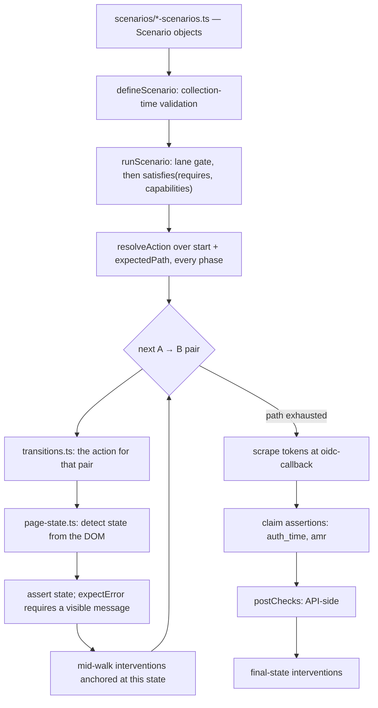

# Identity Platform — Browser & E2E Testing Spec

The approach and the design. Companion documents:

| Document | Contents |
|---|---|
| `docs/ci-spec.md` | When, where and with which credentials the lanes run |
| `docs/juju-lane-runbook.md` | Operational runbooks for the charmed backend |
| `tests/browser/README.md`, `LANES.md` | How to add a scenario/transition/capability/post check; the internal/live lane split and out-of-band seeding |
| `matrix/config-model.mjs` | The machine-readable model: dimensions, constraints, harness gaps, upstream findings |

The **gate** (3 pinned rows, blocking, per-PR) must be green for a change to land (§6); the **matrix
lane** (3 seed + 5 generated rows, nightly, non-blocking) may be red, because a red row is a named
finding, never a silent skip (§5, §9). Read §1–§2 for why, §6–§7 for what blocks a PR, §8 to add a
test, §9 to add a deployment shape.

## 1. Goal

The Identity Platform is a **composition of services**: what a user experiences depends on which
services are deployed, which login-ui and Kratos flags are set, what credentials the identity has,
and which flow they entered through. Almost every defect found so far is an interaction between two
correctly-behaving components; login-ui#931 exists only on a shape (exactly one first-factor option)
no test environment deployed — missing configurations, not missing tests. This repo tests the
composition and builds nothing: it **deploys** a chosen configuration, **verifies** the deployment
matches it, **seeds** deterministic data, and **drives** real browser journeys and Go E2E tests.

## 2. The idea

| Move | Mechanism | What it buys |
|---|---|---|
| **1. Tests are data** | Declarative scenario objects + one generic runner | Coverage is a data edit, not Playwright code (§8) |
| **2. Deployments are data** | `matrix/config-model.mjs` → generated rows → every substrate | We test shapes operators can actually produce (§3, §9) |
| **3. The deployment proves itself** | Three-layer preflight against the declaration | A failed reconfiguration aborts instead of silently shrinking the run (§9) |

Move 2 derives rows deterministically: the gate profiles are **pinned** rows, known field defects
are **seed** rows (permanent regression sentinels), a pairwise cover fills the rest; compose and the
charmed stack are two materializations of one row. Move 3: declared configuration is the only
gating truth, and the preflight checks substrate state, live behaviour and the product's
self-report against it. **Discovery never drives gating.**

**Determinism is non-negotiable:** `retries: 0` everywhere and one worker (a test that only passes
on retry is a failure); no flaky or quarantine tags exist and adding one fails review; re-seed
before every run; every skip must name a missing capability, or the gate fails.

## 3. The configuration surface

**9 dimensions**, every value cited to charm source in `config-model.mjs`:

| Dimension | Values | What it controls |
|---|---|---|
| `local_idp` | on, off | Password/profile/code methods; recovery + verification flows |
| `mfa` | enforced, off | TOTP + backup codes; session AAL requirements |
| `verification` | on, off | Email verification flow + registration hand-off |
| `webauthn` | none, sequencing, (passwordless†) | Security keys; *sequencing* = post-OIDC security-key step-up |
| `providers` | 0, 1, 2 | External OIDC providers (integrator apps); 0 is a shipped default |
| `tenant_service` | present, absent | Multi-tenancy (tenant selection, tenant claims) |
| `hook_service` | present, absent | Hydra token hook — claim enrichment (groups, tenant_id) |
| `user_verification` | present, absent | Registration webhook + its error page |
| `access_token` | jwt, opaque | Token shape relying parties receive (opaque‡ only without add-ons) |

† `passwordless` is retired from generation (constraints `passwordless-needs-local-idp`,
`passwordless-unmaintained-upstream`); the dimension still documents the charm option. ‡ `opaque`
never pairs with a present add-on — both admin APIs are JWKS-only, so nothing can be seeded
(constraints `opaque-tokens-lock-out-tenant-admin`, `opaque-tokens-lock-out-hook-admin`).

**7 constraints** (`constraints` in `config-model.mjs`) exclude documented-invalid, aliasing or
unadministrable combinations. **Invariant:** login style is not a dimension — identifier-first is
the only supported style, the one-step (unified) flow is deprecated, and
`capabilities().identifier_first_enabled: true` is enforced by the preflight (§10 item 14).

### From model to rows

`generate.mjs` is a deterministic greedy pairwise cover: pinned rows take pair credit, seed rows are
never dropped, generated rows fill the remaining pairs. Each row materializes under
`matrix/rows/<name>/` as a compose override, `juju.tfvars.json`, and `capabilities.json` — the only
gating truth. Seed rows: `pd931-single-oidc-mt` (the login-ui#931 shape), `tfdefault-oidc-only`
(the charm's own terraform-default shape, which no profile resembled) and `deployed-core-local-mfa`
(the internal charmed CORE shape, read off iam.orange.canonical.com). A seed row may declare
`backends` (§4): `deployed-core-local-mfa` is bound to `urls`, gets `capabilities.json` only, and is
refused (single row) or listed out of scope (`--all`) elsewhere.

### Coverage, generated rather than asserted

| Quantity | Value |
|---|---|
| Valid rows in the space | 280 |
| Achievable dimension pairs | **155** |
| Rows needed to cover them | **11** — 3 pinned + 3 seed + 5 generated |
| Pairs covered by the 3 pinned profiles alone | **68 (43.9%)** |
| Further pairs added by the 3 seed rows | 35 |

Re-derive with `jq .stats matrix/matrix.json`; at the current tree that is
`{"validRows":280,"achievablePairs":155,"coveredByPinned":68,"coveredBySeeds":35,"generatedRows":5,"totalRows":11}`.
If `matrix/config-model.mjs` changes, run `make matrix-generate && make matrix-check` and update this
table; a drop in the pinned figure means the gate profiles got narrower.

## 4. Deployment interfaces

One row, five ways to run it, one contract everywhere:
deploy/attach → preflight (`matrix/verify.mjs`) → seed → suite → expected-set verdict. Mechanics in §9.

| # | Interface | Status |
|---|---|---|
| 1 | Docker Compose (`--backend=compose`) | Proven — the gate + matrix default |
| 2 | Juju, clean deploy (`--backend=juju`) | Proven — terraform root, rows as var-files |
| 3 | Juju, **attach** to an existing deployment (`--attach`) | Proven — ephemeral-state terraform import; `--plan-only` = zero-mutation drift gate |
| 4 | Juju without k8s-manifest access | Groundwork — mail/dex are declared capabilities; a mail-less target runs the subset |
| 5 | URLs only (`--backend=urls`) | Proven against `iam.orange.canonical.com` (row `deployed-core-local-mfa`): preflight green from the public ingress alone, 5 checks pass, 6 warn-skip |

Interfaces 3 and 5 are defined by what they **refuse** to do. **Attach** never deploys apps onto a
cluster it does not own, never refreshes charms it did not pin, never manages foreign secrets, and
refuses rows that need absent applications; `--plan-only` is a CI drift gate. **URLs** needs no
substrate credentials — `LOGIN_UI_URL` and optional admin/hydra/mail/dex URLs are the interface.

## 5. What runs today

Two provenances, kept apart: **measured live** (the gate, `make gate-all-profiles`; seed rows on the
charmed stack, `make test-matrix` — never asserted here) and **offline-provable** (`make matrix-check`).

### The gate (blocking, per-PR)

Measured 2026-09-19 with `make gate PROFILE=<name>`, on a tree collecting 63 tests (64 with sequencing):

| Profile | Executed (×2 runs) | Failed | Flaky | Capability skips | Manifest shape (both runs) |
|---|---|---|---|---|---|
| `core` | 20 | 0 | 0 | 43 | `0076976be2ea` |
| `canonical-internal` | 47 | 0 | 0 | 17 | `1125d9650c40` |
| `canonical-portal` | 54 | 0 | 0 | 9 | `438cc139443c` |

Both runs of every profile executed an identical set with an identical manifest fingerprint (§10
item 13's detector); the union check (§6) passed; `known-coverage-gaps.json` holds 7 entries.

### The matrix lane (non-blocking, nightly-shaped)

**Offline-proven.** The tier-A executed set for each seed row is a pure function of its
`capabilities.json`, pinned in `matrix/tests/expected-set.test.mjs` and asserted by `make matrix-check`:

| Seed row | Scenarios it must run |
|---|---|
| `pd931-single-oidc-mt` | exactly **12** |
| `tfdefault-oidc-only` | exactly **8** |
| `deployed-core-local-mfa` | exactly **21** |

The three sets pairwise differ (two oidc-only shapes, one local-user shape), so the canaries
discriminate; re-derive any cell with `cd tests/browser && npx tsx scripts/expected-set.ts ../../matrix/rows/<row>/capabilities.json`.
Generated rows red on the charmed backend are named findings (§10 item 2), recorded per row.

### Harness self-tests (no cluster, seconds; counts rise with every canary)

| Command | Covers | Count |
|---|---|---|
| `make matrix-test` | The matrix runner's pure logic; chained into `matrix-check` | **66** tests |
| `make test-browser-unit` | The suite framework's pure logic — scenario validation, claim assertions, manifest, ownership | **76** tests |

## 6. The gate

```
make gate PROFILE=<name>        # one profile
make gate-all-profiles          # every profile + the cross-profile coverage check
```

typecheck → `make up` → Go smoke → re-seed `--fresh` → browser run 1 → re-seed `--fresh` → browser
run 2 → Go E2E → verdict. It fails on any of five conditions:

| Fails on | Because |
|---|---|
| Any test failure | — |
| Any **flaky** test | `retries` is pinned to `0` in every environment, so a pass-on-retry is a failure |
| Any **unjustified skip** | A skip is allowed only when its reason names a capability the deployment lacks; `tests/browser/scripts/gate.mjs` matches it against an allow-list |
| The **executed** set differing between the two runs | Two runs on identical inputs must execute identically — §10 item 13 tracks the open split |
| The **collected** set differing from `tests/browser/expected-tests.json` | Catches a spec that silently stops being collected (bad `testMatch`, rename, throw at load); every other signal describes tests that WERE collected. Regenerate with `npx playwright test --list --reporter=json` when intentional |

**The cross-profile union check.** `make gate-all-profiles` asserts that the union of tests executed
across all profiles covers every test the suite collects: a profile may legitimately skip what it
cannot deploy, but a test that skips **everywhere** is dead weight. Genuinely-blocked tests live in
`tests/browser/known-coverage-gaps.json` with a reason and an unblock condition; the check also
fails **if a registered entry starts running again**, so the register cannot rot into a quarantine
list. The property is *zero skips without a declared capability reason*, not zero skips.

**The Go E2E suite fails when it has nothing to run.** `tests/e2e/integration` needs
`E2E_USE_EXISTING_DEPLOYMENT=true` (the `make` targets set it); without it `TestMain` exits non-zero
rather than reporting `ok` for a package that ran nothing. `E2E_ALLOW_SKIP=1` skips deliberately on
a workstation with no stack up; **CI must never set it.** The `service → profiles` map is derived at
`TestMain` from `matrix/matrix.json` plus each pinned row's `capabilities.json`. All Go targets pass
`-count=1`: the live deployment is not in go's test-cache key, so a cached pass could report green
against a stack that is down.

## 7. Profiles

The three gate profiles are **pinned rows of the matrix** (`matrix/rows/<name>/`); the gate
consumes the capabilities file via `BROWSER_TEST_CAPABILITIES`. No hand-written profile config exists.

| Profile | Beyond kratos/hydra/postgres/traefik/login-ui | MFA | Multi-tenancy | Earns its place by |
|---|---|---|---|---|
| `core` | — | off | off | The **no-MFA baseline** — the only shape where `login-mfa-off` can run |
| `canonical-internal` | hook-service, user-verification, openfga | enforced | off | The only profile with OIDC/WebAuthn **sequencing** (+ Google provider declared) |
| `canonical-portal` | hook-service, user-verification, openfga, **tenant-service** | enforced | **on** | The widest *runnable* shape: enforced MFA (TOTP + backup codes) with WebAuthn-as-2FA, no sequencing; the **only** pinned row with multi-tenancy on (tenant-service `v0.3.1` carries the PD-1 interceptor fix), so `requires.multiTenancy=true` journeys execute here and nowhere else in the gate |

| Quantity | Value | Re-derive with |
|---|---|---|
| Tests collected | **63** (64 where sequencing is on) | `jq .total tests/browser/expected-tests.json` |
| Registered gaps | **7** — three Google scenarios needing Workspace credentials, plus four shapes no gate profile deploys (prompt-on-use backup codes, verification off, MT + sequencing) | `jq '.gaps \| length' tests/browser/known-coverage-gaps.json` |
| Executed per profile | `core` 20, `canonical-internal` 47, `canonical-portal` 54 — measured 2026-09-19 (§5) | `make gate-all-profiles`, then `jq '{profile, executed: (.executed \| length)}' tests/browser/coverage/*.json` |

`oidc.spec.ts` picks its scenario suite at **collection** time from the declared
`oidc_webauthn_sequencing_enabled`; the sequencing suite carries one extra scenario
(`oidc-webauthn-assertion`), hence the two-element expected total. No single profile runs
everything; the union across the three is the coverage claim. Decisions that bind the suite:

- Google journeys are opt-in on `GOOGLE_TEST_*` credentials and never in the blocking gate (Google
  refuses automated browsers, rate-limits, and changes its UI without notice); Dex is the gate's
  external provider.
- Opaque-token introspection is not tested: hydra's admin introspection is internal-network only on
  every real deployment, so opaque rows assert on the ID token alone and `access_token_format` stays
  a preflight-verified shape fact.
- A service's direct API contract (hook-service `POST /api/v0/hook/hydra`, user-verification
  decisions) belongs to that service's own suite; this plane tests cross-service claims (§10 items 7, 8).

### What the tokens prove, not just the pages

- **`auth_time` across phases.** A replayed session produces the same path as a real
  re-authentication, so `reauthenticated(from, to)` (`framework/claim-assertions.ts`) asserts
  `auth_time` **advanced**; under `max_age` the OP must return it (OIDC Core §3.1.3.7), so a missing claim fails.
- **`amr` as a product assertion.** PD-4: an enrolled security key does not satisfy login-ui's MFA
  *enforcement* decision, TOTP does — asserted as `amr` including `totp` and excluding `webauthn`.
  This pins the branch the scenario **walks**, not a platform impossibility (login-ui#884 made
  WebAuthn a usable second factor): `webauthn-key-only-forces-totp-enrolment` shows the key
  assertion accepted (`amr` records `webauthn`) and TOTP re-enrolment still forced mid-login.
- **The WebAuthn assertion ceremony is covered by exactly one scenario**, `oidc-webauthn-assertion`
  (sequencing rows only): phase 1 enrols a key; phase 2 starts with `freshSession: true` — cookies
  cleared, virtual authenticator and credential intact — so the platform must ask the key to sign.
  Every other WebAuthn journey enrols.

## 8. Browser suite architecture

**Scenarios are data, not logic**: a declarative object walked by a generic runner. `tests/browser/README.md` is the how-to; this section is the contract.

| Field | Meaning |
|---|---|
| `id` | Stable identifier, also the test name and the unit the expected-set check counts |
| `requires` | Capability predicate, evaluated against the row's declaration by `satisfies()` |
| `user.ref` | Which seeded archetype to drive — never an inline credential |
| `expectedPath[]` | The states the journey must pass through, in order |
| `expectError` | Require a visible error message at every self-transition |
| `freshSession` | Clear cookies at the start of a later phase, keeping the virtual authenticator |
| `interventions` | Declared perturbations anchored to this scenario's own path |
| `postChecks` | Named API-side checks run after the walk |
| `assertions` | Named claim assertions over the tokens the RP received: fixed-shape flags (`noTenantId`, `tenantIdFromSeed`, `groups`, `noGroups`) plus `claims[]`, tagged objects built by the `framework/claim-assertions.ts` factories |
| `finalUrlContains` | Declarative pin on the terminal URL, e.g. `error=invalid_scope` |
| `cleanup` | Named admin-API cleanup, required when the scenario mutates a shared identity |
| `defaultLanes` | Which lanes the scenario belongs to (*Determinism and lanes*, below) |

### The walk



1. **A bad declaration fails at collection** (`defineScenario()`, `framework/scenario-types.ts`):
   `expectedPath`/`phases` both or neither; `assertions`/`postChecks` off an `oidc-callback` terminal
   (exception: `device-complete` under `requires.deviceFlow`); `expectError` with no self-transition
   or alongside `phases`; `freshSession` on the first phase; `interventions` alongside `phases`; an
   intervention anchored where it would never fire or is illegal (table below); a primitive missing
   its required option (`via`, `untilUrl`, `expect`) or given one it does not take; a duplicate `id`.
2. **An illegal path fails before any browser work.** `runScenario` resolves every pair of
   `["start", ...expectedPath]` for every phase against `TRANSITION_TABLE` first and throws listing
   the pairs with no action; a pair is legal iff it has an entry.
3. **Final-state interventions run AFTER the token scrape**, so claim assertions and post checks see the legitimate exchange.

### Where the logic lives

| File (under `tests/browser/`) | Responsibility |
|---|---|
| `scenarios/*-scenarios.ts` | The data. One suite per journey family |
| `framework/scenario-types.ts` | `defineScenario()` / `defineScenarioSuite()` — validation at collection time |
| `framework/scenario-runner.ts` | Walks `expectedPath` pairwise; owns the error-message requirement |
| `framework/transitions.ts` | The action map: one entry per `"stateA → stateB"` pair — a pair is legal iff it has an entry |
| `framework/interventions.ts` | The executable half of `interventions` |
| `framework/claim-assertions.ts` | The `assertions.claims` factories: `reauthenticated`, `amrRecords`, `subjectIsSeededIdentity` |
| `framework/intervention-checks.ts` | Named `postChecks` implementations |
| `helpers/page-state.ts` | Detects the current state from the DOM — never the URL; login-ui multiplexes many states onto few URLs |
| `seeder/` | **All** admin-API access; writes `manifest.json`. Specs are browser-only |

Token-claim assertions evaluate against both tokens the RP received (opaque access tokens are
claim-less by declaration); a scenario never carries an inline callback, so every assertion is
countable from the data. The device grant is the second token source: the runner redeems
`ctx.deviceCode` at the token endpoint after `device-complete`; a failed poll fails the walk.
Decided: `consent` is not supported — login-ui auto-accepts every request with `remember=true`, so
the state, its detector and its edge were deleted (§10 item 12); nothing here would catch a
consent-screen regression or scope escalation. Decided: no exact-shape `requires` predicate
("exactly one provider") — no login-ui surface forks on it, and an unconsumed predicate is dead.

**Error paths declare `expectError: true`.** An error scenario is a **self-transition**
(`[…, "login-password", "login-password"]`); "did not navigate" alone is weak, so `expectError`
makes the runner require a visible, non-empty error message after every self-transition
(`ERROR_MESSAGE_SELECTORS` in `framework/scenario-runner.ts`). `expired-totp-code` submits a code
computed three periods back (`totpCodeWindow: "expired"`), past Kratos's skew, so no test sleeps.
**Error terminals are enterable from `start` only**: the `oidc-error` suite drives malformed
authorize requests as plain `flowParams`, making `start → oidc-error-page` and
`start → oidc-callback-error` legal edges; a mid-journey step into an error state is illegal, and
`finalUrlContains` pins the exact error code.

### Weird user behaviour is declared, not scripted: `interventions`

`{at: <state>, do: …}` runs after that state's assertion; `{on: "<A → B>", do: "double-submit"}`
modifies how that transition submits. Primitives live in `framework/interventions.ts`:

| Primitive | Anchor | What it does | Where legal |
|---|---|---|---|
| `reload` | `at` | F5; the same state must re-detect afterwards (login-ui persists `?flow=` via `router.replace`) | Anywhere **except** `oidc-callback`, where a reload re-sends the authorization code |
| `replay-current-url` | `at` | Re-navigate to the exact current URL, assert a declared terminal (`expect`, optional `expectUrlContains`) | Final path state only |
| `history-roundtrip` | `at` | Real Back must land on `via`, real Forward must land back on the anchor, **and the walk continues** | Mid-walk, because it is self-returning |
| `history-back` | `at` | Walk history backwards (bounded) until the URL contains `untilUrl`, let redirects settle, assert the declared terminal | Final path state only |
| `resend-code` | `at` | Click resend, require the cooldown countdown, wait for the resent mail and re-anchor the mail cursor so the following submit proves newest-code-wins | `verification` only, never at a final state, no `expect`/`untilUrl`/`via` |
| `drop-totp-out-of-band` | `at` | Deletes the identity's TOTP credential through the admin API mid-walk, so the following step sees a key-only identity | Mid-walk only; no options; internal lane |
| `double-submit` | `on` | Modifies that transition's submit | Transitions whose action supports the flag |

No standalone `history-forward`: Back triggers a server redirect everywhere except the TOTP ⇄
backup-code method switch, which `history-roundtrip` covers. At runtime the runner fails loudly when
a `double-submit` targets a transition whose action ignores the flag. Wave 2 is in §10 item 11.
**`postChecks` are named API-side checks** (`framework/intervention-checks.ts`) run after the walk
against the RP's tokens; `code-replay-revokes-family` re-exchanges the authorization code and
asserts the original refresh token is dead (RFC 6749 §10.5), because the browser half of a callback
replay is absorbed by the consumer's state guard.

### Determinism and lanes

The §2 rules apply verbatim: `workers: 1`, `fullyParallel: false` (Kratos identities and sessions
are global mutable state), `retries: 0`, no flaky/quarantine tag, re-seed before every run (several
scenarios permanently mutate their identity). Scenarios that mutate a *shared* identity must declare
a `cleanup` that works via the admin API even when the scenario failed halfway.

`BROWSER_TEST_LANE` selects `internal` (default; full access including Mailslurper and admin
bootstrapping — the gate and the matrix) or `live` (UI only; safe against a real deployment). Gating
is at suite level via `defaultLanes`, with `assertInternalLane()` (`framework/transitions.ts`) as a
runtime backstop and `scripts/audit-live-compat.mjs` enforcing the boundary statically. Operator
doc: `tests/browser/LANES.md`.

## 9. The configuration matrix

| Artifact / command | Role |
|---|---|
| `matrix/config-model.mjs` | The model (§3). **Source of truth** — everything below is generated from it; `make matrix-check` fails CI on drift |
| `matrix/generate.mjs` | Deterministic greedy pairwise cover. Pinned rows take pair credit, seed rows are permanent, generated rows fill the rest |
| `matrix/rows/<name>/` | Per row: compose override, `capabilities.json` (shaped like the suite's `ActiveConfig`, backend-divergent keys under `juju`), `juju.tfvars.json` for charm-producible rows. A `backends`-bound seed row gets `capabilities.json` only |
| `make matrix-generate` / `matrix-check` | Regenerate / verify artifacts against the model (check runs the offline harness tests first) |
| `make matrix-up ROW=<name>` | Deploy one row on compose |
| `make test-matrix-row ROW=<name> [BACKEND=compose\|juju\|urls] [ATTACH=1 [PLAN_ONLY=1]]` | One row under the full contract |
| `make test-matrix` | The nightly lane: every seed+generated row, verdict table at the end |

### The anti-silent-shrink contract

Rows are deployed by *reconfiguring* the running stack; a reconfiguration that does not land, plus
discovery-driven gating, would report green with a smaller executed set. Three mechanisms close that:

1. **Declaration, not discovery.** The runner installs the row's `capabilities.json`
   (`BROWSER_TEST_CAPABILITIES`) and the suite gates every scenario on it via `satisfies()` — the
   ONLY gating predicate, in every lane.
2. **Preflight or nothing.** `matrix/verify.mjs` must pass before any test runs; any failure aborts
   with "deployment does not match declaration — refusing to test", naming every drifted check.

   | # | Layer | What it checks | Independent witness? |
   |---|---|---|---|
   | 1 | **Substrate** | compose: services, env, config files. juju: app status, `juju config` equality, presence/absence of every toggled relation | **No** — compares against the same `expectedEnv()` that generated the override |
   | 2 | **Behaviour** | methods and providers the flows offer; recovery/verification enabled-vs-404; the AAL a real session is held to (throwaway identity, enrol a factor, `/sessions/whoami` refuses AAL1 with 403); which second factors settings will enrol; a real token minted and shape-checked; hydra wired to the token hook (hook-service's request counter advances across the mint); login style identifier-first (§10 item 14); device URLs configured; mail API reachable | **Yes — the only one** |
   | 3 | **Self-report** | `/api/v0/app-config`: four truthfully-served keys are fatal on mismatch; the known-lying rest is logged as PD-5 drift | Partly — four keys only |

   Two declared dimensions are **not behaviourally probed** — `tenant_service` (structural presence
   only; the tenant scenarios exercise the binding) and `user_verification` (health-pinged only).
3. **The skip set is computed and asserted.** `scripts/expected-set.ts` derives, from the
   declaration and the *same* `satisfies()`, which scenario-driven tests must run; the executed set
   is compared in **both directions**, so a test that skipped when it should have run, or ran
   undeclared, fails the row. Tier-B specs must skip with reasons matching the allow-list.

### The charmed backend and attach mode

`generate.mjs` emits `juju.tfvars.json` per row; `matrix/backends/juju/root/` is the one terraform
deployment rows are applied to (revision-pinned charms): presence dimensions → relation toggles,
provider count → the integrators' `enabled` config. The preflight's substrate layer swaps to juju
ground truth; behaviour and self-report run unchanged. Browser journeys run by default
(`MATRIX_JUJU_BROWSER=0` opts out) against the real ingress and dex. Runbooks: `docs/juju-lane-runbook.md`.

`--attach` configures a deployment that already **exists** using pure terraform: ephemeral state
(isolated workspace, wiped per run), import blocks generated from live discovery, then plan/apply of
the same root module in two phases (an import cannot target a `count = 0` address): **adopt**
(import, relations exactly as discovered), then **transition** (apply the row's values, so the plan
is exactly the declared change). Safety properties, all load-bearing: never deploys apps; never
refreshes charms it did not discover; never manages foreign secrets; refuses rows requiring absent
apps; `--plan-only` reports drift + pending transitions with **zero mutation**.

### URLs backend (no substrate access)

`--backend=urls` runs a row's contract against nothing but env URLs. `LOGIN_UI_URL` is required; the
rest are optional and capability-shaping:

| Missing URL | Effect on the run |
|---|---|
| `KRATOS_ADMIN_URL` | seeding skipped loudly, live-lane subset |
| `HYDRA_ADMIN_URL` | token-hook probe warn-skips; access-token shape falls back to minting with the seed manifest's svc client when `MANIFEST` is set, and warn-skips without one |
| `HYDRA_PUBLIC_URL` | the RP consumer is not started, so authorization-code journeys fail unless `OIDC_CONSUMER_URL` names an external one |
| `KRATOS_PUBLIC_URL` | kratos flow-shape probes warn-skip |

No URL falls back to `localhost` here: an unset URL means *this surface is not reachable from here*.
The preflight skips the substrate layer; behaviour probes, self-report and gating are unchanged.
**Read kratos config off kratos, never off the ingress.** On a charmed deployment the public ingress
routes `/self-service/*` to the login-ui BFF, whose route table is a login-ui *version* fact (a
missing BFF route 404s; kratos never 404s a disabled flow). The behaviour layer proves kratos
answers first (`GET /self-service/login/api`, never routed by the BFF): not kratos ⇒ on `urls` a
warning naming the skipped probes plus the one BFF witness (`/self-service/login/flows?id=`); on
compose/juju a hard failure. **An app-config key the deployment does not emit is not drift**
(`multi_tenancy_enabled` arrived in login-ui v0.27.0, `flags` in v0.24.0); present-and-different
still aborts, in the preflight and in `global-setup` alike.

**TLS verification is on in this backend.** Opt out per run with `MATRIX_INSECURE_TLS=1`, the only
thing that sets `NODE_TLS_REJECT_UNAUTHORIZED=0` + `BROWSER_TEST_INSECURE_TLS=1` here
(`insecureTlsEnv()` in `matrix/run-row.mjs`; `playwright.config.ts` derives `ignoreHTTPSErrors` and
chromium's `--ignore-certificate-errors` from the latter). The charmed backend keeps insecure TLS
unconditionally (self-signed CA this harness created); the compose gate sets neither. An
**incomplete chain** (`iam.orange.canonical.com` serves the leaf alone) is a finding: the harness
never fetches missing intermediates. Fix the server, or point `NODE_EXTRA_CA_CERTS` at them
(`curl -o - http://yr1.i.lencr.org/ | openssl x509 -inform DER`, likewise for the issuer in *its*
AIA) — verification stays on. `MATRIX_INSECURE_TLS=1` would hide the next real certificate problem.

## 10. Open work

Item numbers are stable references; other documents cite "§10 item N".

| # | Item | Status | Pointer |
|---|---|---|---|
| 1 | Scenario variants for legitimate behaviour forks | Landed | dex-entered tenant journeys (+ `-sequencing` twins, `pd931-single-oidc-mt` canary), `link-at-login-sequencing`; `tenantIdFromSeed` asserts the claim absent where hook-service is not deployed; opaque introspection and exact-shape `requires` dropped (§7, §8) |
| 2 | Remaining generated rows green on juju | Blocked | Detail below |
| 3 | Upstream releases unblock the registered gaps | Blocked | Detail below |
| 4 | `smtp-integrator` instead of the mailslurper fallback | Staged | Detail below |
| 5 | Attach on real dev/stg | Blocked | Detail below |
| 6 | CI dry run of the hosts-pinned ingress mode | Staged | Detail below |
| 7 | user-verification-service functional coverage | Blocked | Detail below |
| 8 | hook-service coverage | Closed | Service-direct contract belongs to the service's suite (§7); the cross-service claim is covered: preflight `token hook wired`, `login-carries-group-claim`, `tenantIdFromSeed`, Go `tenant_webhooks_test.go` |
| 9 | OIDC error paths | Landed | `oidc-error` suite: unknown `client_id`/`redirect_uri` → login-ui error page; bad scope / `prompt=none` → `?error=` on the RP callback (`ory/hydra@34a5fb709607 oauth2/handler.go:1369-1382`); pins the `error_debug` surface |
| 10 | Device authorization grant | Landed | `device` suite; `device_flow` capability, `requires.deviceFlow`; states `device-code`, `device-complete`; polled tokens are the assertion source; `device-code-invalid-rejected`, `authorization_pending` before approval, `device-code-replay-rejected`; expired-code waits on item 11's prerequisite |
| 11 | Navigation & weird-user-behaviour coverage | Wave 1 landed; wave 2 staged | Detail below |
| 12 | Dead machinery in the transition table | Resolved | Every coverable edge traversed; `consent` deleted (§8). Re-derive by walking `TRANSITION_TABLE` (`framework/transitions.ts`) against every suite's `expectedPath` with the synthetic `start` prepended; the 10 Google alternates stay unused by design |
| 13 | The unexplained run-1/run-2 split | Open | Detail below |
| 14 | Preflight asserts identifier-first | Landed | Layer-2 check `login style identifier-first`: `method=identifier_first` submit and no `password` node on step 1 (ory/kratos@64e04ac `selfservice/strategy/idfirst/strategy_login.go:175-193`; the unified style puts `password` on step 1, `selfservice/strategy/password/login.go:208-213`, switch at `driver/config/config.go:1601-1603`); runs on every backend, through the BFF mirror on `urls` |
| 15 | Account-linking coverage | Landed | `account-linking` suite: `link-at-login` (collision entered from the register page; post-link `sub` equals the seeded `identityId`), `settings-link-and-unlink` (`connected-accounts` state, `remove-oidc` cleanup); two defects in `upstreamFindings` (stranded post-link session; TOTP-bearing collision collapses to a bare 500); `account_linking_enabled` ⇐ oidc |
| 16 | Blocking PR gate CI integration | Implemented | `docs/ci-spec.md` |

### Detail

**2. Remaining generated rows green on juju.** Blocked on the kratos-operator wedge filed upstream
(`upstreamFindings`: null `verification.ui_url` render, no self-recovery). The harness only journals
it (runbook D-3), so rows hitting it fail their settle budget and stay red until the fixes land.

**3. Upstream releases unblock the registered gaps.** No overlays exist (D-2). Critical path: a
login-ui-operator release rendering `TENANT_SERVICE_GRPC_ADDRESS`
([login-ui-operator#496](https://github.com/canonical/identity-platform-login-ui-operator/pull/496)),
which unblocks MT rows on the charmed backend.

**4. `smtp-integrator`** instead of the kratos charm's mailslurper fallback, so the smtp relation
path is tested. Staged; no blocker.

**5. Attach on real dev/stg.** Blocked on the runbook's attach prerequisites: constraints
capture-and-pass, single-model topology audit, JIMM auth vars (`docs/ci-spec.md` §2), store-charm-only target.

**6. CI dry run of the hosts-pinned ingress mode** (runbook, *Substrate identity*) before a pipeline
trusts it. Staged; needs one end-to-end run.

**7. user-verification-service functional coverage.** Deployed on two profiles and health-pinged. A
verification DECISION comes from Salesforce and the test plane owns no Salesforce tenant. Unblocked
by a test-plane Salesforce sandbox or a stub decision source the charm can point at; either becomes
one gated scenario.

**11. Navigation & weird-user-behaviour coverage.** Landed: the `resilience` suite (reload,
double-submit, callback replay + family revocation, history-back, Back/Forward round-trip),
`oidc-error`, `specs/recovery-code-abuse.spec.ts`, `recovery:wrong-codes-rejected-in-place`, the
settings surface (TOTP unlink, backup-code deactivate/reuse/regenerate; `backup_code_prompt_on_use`
models the login-ui version fork), and `resend-code` (two `verification-resend-*` scenarios; pins
PD-10: the verification resend button re-enables after 90 ms while the UI shows a 1m30s countdown —
login-ui passes `RESEND_CODE_TIMEOUT = 90 // seconds` unscaled to `setTimeout`; the primitive fails
loudly when that is fixed). Staged, in value order: passkey delete (no scenario or transition exists);
S-2 mode 1 (used consent challenge with a live session); kratos-vs-hydra session split-brain (admin
revoke → re-authorize must re-challenge); short-lifespan expiry lanes (S-1);
`prompt=login`/`prompt=none`/`id_token_hint` request-shaping; the tenant token webhook (Go-suite work).

| Wave-2 primitive | Anchor | What it does | Where legal |
|---|---|---|---|
| `back-forward-switch` | `at` | Navigates Back across method-switch boundaries, then Forward to resume | Mid-walk (MFA method-switch states) |
| `concurrent-session-revoke` | `at` | Revokes the current session out-of-band via admin API before the next submit | Mid-walk (authenticated states) |
| `expired-token-submit` | `at` | Submits after flow lifespan expiry, asserts the flow-expired terminal | Final or mid-walk state |
| `resend-code` at `reset-email-code` | — | Refuted: the v0.28 recovery code page renders no resend control | — |

Collection-time rejections: `back-forward-switch` off a state with a multi-method sibling step;
`concurrent-session-revoke` on `live` scenarios or before session establishment;
`expired-token-submit` without flow-expiry handling or the `short_lifespans` capability.
Prerequisite for expiry coverage: a short-lifespans row — a 10th cited dimension if the operators
expose lifespan config, else a seed-style row with a documented divergence, lifespans ≤5 s and a
`short_lifespans` capability threaded through `capabilities()` / `satisfies()` / `expected-set.ts` /
`verify.mjs`; the scenario pins the platform's actual terminal (§11).

**13. The unexplained run-1/run-2 split.** Symptom: one scenario fails on one of the gate's two runs
and passes the other, with identical declaration, `--fresh` re-seed and manifest shape (the
`gate.mjs` detector). Three instances, three unrelated scenarios, always the first run; warm-up
refuted. Rate: 3 in ~8 local gates, 0 in 6 CI gates, 0 in the 3 gates of 2026-09-19. Artifacts are now
retained per run (`test-results/run-N/` trace/video/error-context, raw `report.json`, error bodies
and timestamps in the gate log, timestamped CI compose logs). Cause open; no hypothesis favoured.

## 11. Reviewing a change to this suite

**Does it actually test something?**

- Does every new test fail if the behaviour it describes breaks? If not, it is documentation, not a test.
- Does it assert the product's real behaviour, or an aspiration?
- Is it the strongest assertion available? "Did not navigate" is weak where a visible error message
  is checkable (`expectError`, §8); a path is weak where a claim is checkable (`auth_time`, `amr`, §7).

**Is it deterministic?**

- Can it run twice in a row against one seed? If not, why not?
- If it mutates a shared identity, does it declare a `cleanup`, and does that cleanup work when the
  test fails halfway?
- No new retry, flaky tag or quarantine list — adding one fails review.

**Does it gate honestly?**

- Does it add a skip? The reason must name a capability, and the test must still execute on some
  other row or profile.
- Does the scenario declare only what its walk actually uses? A `credentials`/`totpConfigured` claim
  the path never exercises makes the scenario unrunnable on profiles that legitimately lack that
  credential — it reads as a precondition but behaves as an exclusion. This has shipped twice,
  caught both times by a profile gate rather than by review.

**Does it fit the model?**

- New coverage is a `Scenario` object, not a hand-written spec, unless the behaviour genuinely does
  not fit the state-transition model.
- New declarative machinery — a transition, an intervention, an assertion, a post check — must fail
  at **collection** when misused, never degrade to a runtime no-op.

**Is the evidence citable?**

- Findings cite upstream sources as commit-pinned permalinks or `<repo>@<sha> path:line`, never
  paths into a local clone.
- A claim about the product names the date and the build it was measured on.
