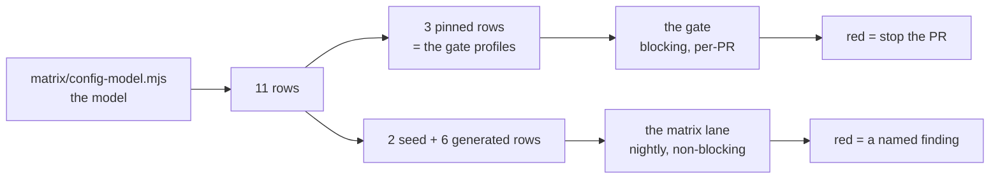
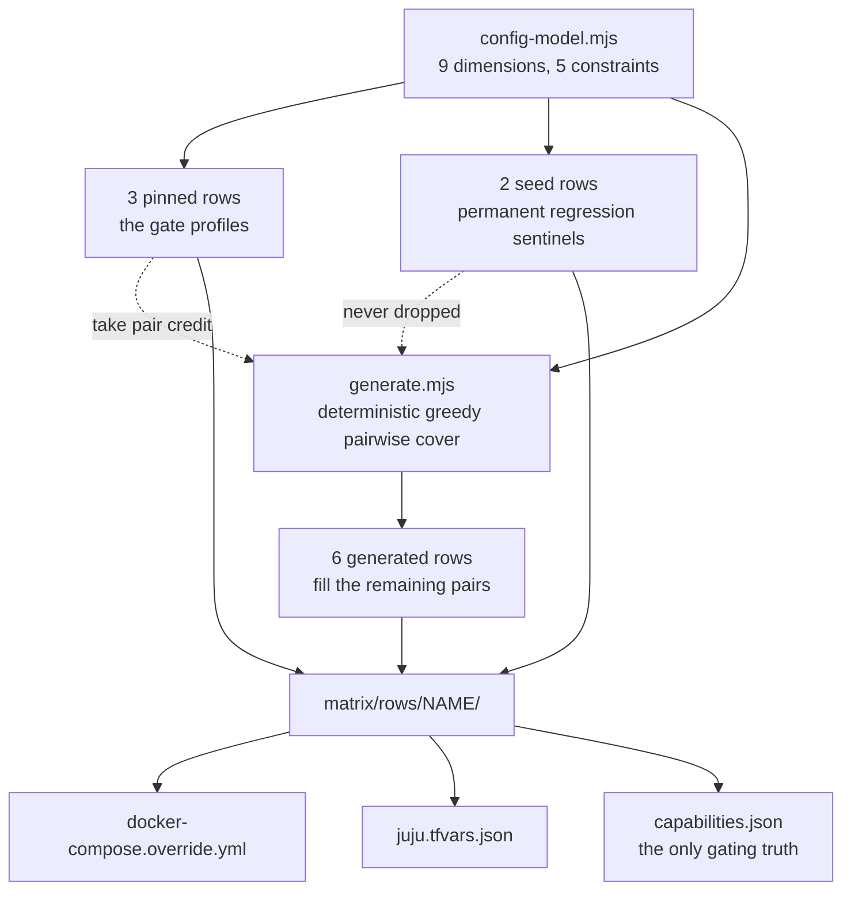
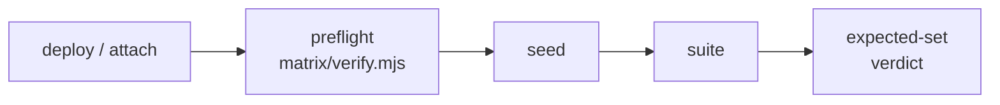
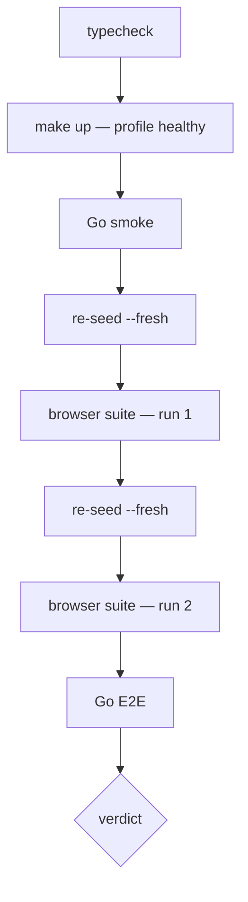
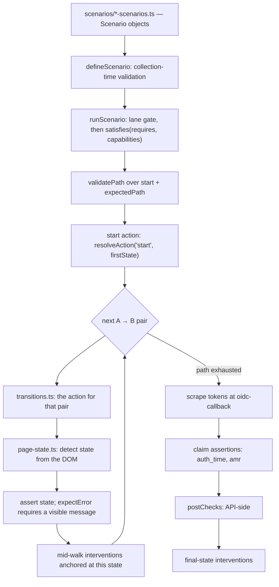

# Identity Platform — Browser & E2E Testing Spec

Status: for team review. The gate is green on all three profiles; re-derive
with `make gate-all-profiles`.

This spec is the approach and the design. Everything else moved out deliberately:

| Document | Contents |
|---|---|
| `docs/juju-lane-runbook.md` | Operational runbooks for the charmed backend |
| `tests/browser/LANES.md` | Operator doc for the internal/live lane split |
| `docs/testing-proposal.md` | The review-facing RFC for this same architecture — narrative and rationale, no contracts. This spec is authoritative where they disagree |
| `matrix/config-model.mjs` | The machine-readable model: dimensions, constraints, harness gaps, upstream findings |

### The shape of it



Two lanes, two different jobs. The **gate** must be green for a change to land
(§6). The **matrix lane** is allowed to be red, because a red row there is a
finding with a name and an owner, never a silent skip (§5, §9).

Reading order, if you are new: §1–§2 for why, §6–§7 for what blocks a PR, §8 if
you are adding a test, §9 if you are adding a deployment shape.

---

## 1. Goal

The Identity Platform is a **composition of services, not a single product**.
What a user experiences depends on four independent things:

1. which services are deployed;
2. which login-ui and Kratos flags are set;
3. what credentials the identity already has;
4. which flow they entered through.

That cross-product is far too large to test by hand — and it is precisely where
the interesting failures live: **almost every defect found so far is an
interaction between two correctly-behaving components.**

The concrete motivating example is login-ui#931: a bug that only exists on a
deployment shape — exactly one first-factor option — that none of our test
environments deployed. No amount of test-writing against the existing
environments could have caught it. The gap was not missing tests; it was
**missing configurations**.

So this repo exists to test the composition. It builds nothing. It:

1. **deploys** the platform in a chosen configuration,
2. **verifies** the deployment matches that choice,
3. **seeds** deterministic data,
4. **drives** real browser journeys and Go E2E tests through it.

## 2. The idea

Three moves, applied consistently:

| Move | Mechanism | What it buys |
|---|---|---|
| **1. Tests are data** | Declarative scenario objects + one generic runner | Coverage is a data edit, not Playwright code |
| **2. Deployments are data** | A machine-readable model → generated rows → every substrate | We test shapes operators can actually produce |
| **3. The deployment proves itself** | Three-layer preflight against the declaration | A failed reconfiguration aborts instead of silently shrinking the run |

**1. Tests are data.** Browser scenarios are declarative objects
(`{id, requires, user, expectedPath, assertions, cleanup}`); a generic runner
walks them. Adding coverage means adding a data object, not writing Playwright
code (§8).

**2. Deployments are data.** The same move one level down. A machine-readable
model (`matrix/config-model.mjs`) declares the platform's
**operator-producible configuration space** — every dimension cited to charm
source, so we test shapes operators can actually produce, not arbitrary env
combinations. A deterministic generator derives concrete deployments ("rows")
from it:

- the three gate profiles are **pinned** rows;
- known field defects are **seed** rows — permanent regression sentinels;
- a pairwise covering set fills the rest of the space.

One model drives every substrate: the compose stack and the charmed
(Juju/terraform) stack are two materializations of the same row (§3, §9).

**3. The deployment must prove itself before tests run.** Declared configuration
is the single source of gating truth — which scenarios run — and an independent
three-layer preflight verifies the running deployment against that declaration:

- **substrate state** — compose env, or juju relations and config;
- **live behaviour probes** — what flows the running Kratos actually offers, what
  shape of token Hydra actually mints;
- **the product's self-report**.

Any mismatch aborts loudly. This is the **anti-silent-shrink contract**: a failed
reconfiguration can never quietly turn 30 tests into 5 trivial green ones, because
**discovery never drives gating** (§9).

### Determinism is non-negotiable

Underneath all three moves:

- `retries: 0` everywhere, one worker;
- no flaky or quarantine tags — none exist, and adding one fails review;
- re-seed before every run;
- every skip must name a missing capability.

A test that only passes on retry is a failure. A skip without a capability reason
fails the gate.

## 3. The configuration surface

**9 dimensions**, every value cited to charm source in `config-model.mjs` — the
space is what operators can actually produce, not arbitrary env combinations:

| Dimension | Values | What it controls |
|---|---|---|
| `local_idp` | on, off | Password/profile/code methods; recovery + verification flows |
| `mfa` | enforced, off | TOTP + backup codes; session AAL requirements |
| `verification` | on, off | Email verification flow + registration hand-off |
| `webauthn` | none, sequencing, (passwordless†) | Security keys; *sequencing* = post-OIDC security-key step-up |
| `providers` | 0, 1, 2 | External OIDC providers (integrator apps); 0 is a shipped default |
| `tenant_service` | present, absent | Multi-tenancy (tenant selection, tenant claims) |
| `hook_service` | present, absent | Hydra token hook — claim enrichment (groups, tenant_id) |
| `user_verification` | present, absent | Registration webhook + its error page |
| `access_token` | jwt, opaque | Token shape relying parties receive |

† `passwordless` (passkeys as the first factor) is retired from generation by
constraint: not actively maintained upstream, and the charm-rendered shape 400s
webauthn-1FA flow creation. The dimension still documents the charm option;
deleting one constraint re-enables it.

**5 constraints** exclude documented-invalid or aliasing combinations — e.g.
sequencing without any OIDC provider, or a shape with no login method at all.

**Invariants:** Login style is not a dimension — identifier-first is the only supported style platform-wide, and the one-step (unified) login flow is deprecated platform-wide (team decision, matching the † precedent above). `capabilities().identifier_first_enabled: true` is an invariant, not a free variable.

### From model to rows



The two seed rows are the ones worth naming, because each encodes a real-world
shape nothing else covered:

| Seed row | Why it is permanent |
|---|---|
| `pd931-single-oidc-mt` | The login-ui#931 shape — exactly one first-factor option |
| `tfdefault-oidc-only` | The charm's own terraform-default shape, which **no profile resembled** |

### Coverage, generated rather than asserted

| Quantity | Value |
|---|---|
| Valid rows in the space | 448 |
| Achievable dimension pairs | **157** |
| Rows needed to cover them | **11** — 3 pinned + 3 seed + 5 generated |
| Pairs covered by the 3 pinned profiles alone | **68 (43.3%)** — the measured gap that motivated the matrix |
| Further pairs added by the 3 seed rows | 43 |

Every number above is generated. Re-derive with `jq .stats matrix/matrix.json`;
at the current tree that is
`{"validRows":448,"achievablePairs":157,"coveredByPinned":68,"coveredBySeeds":43,"generatedRows":5,"totalRows":11}`.
If `matrix/config-model.mjs` changes, run `make matrix-generate && make
matrix-check` and update this table.

The pinned figure is a live indicator, not a constant: a drop here means the
gate profiles got narrower.

The model also records, machine-readably:

- `harnessGaps` — what this harness cannot express yet, and why;
- `upstreamFindings` — product/charm defects found while building it, with
  commit-pinned evidence;
- per-profile `divergences` — where a gate profile intentionally differs from the
  charm-producible space.

## 4. Deployment interfaces

One row, five ways to run it — and **the same contract everywhere**:



| # | Interface | Status |
|---|---|---|
| 1 | Docker Compose (`--backend=compose`) | Proven — the gate + matrix default |
| 2 | Juju, clean deploy (`--backend=juju`) | Proven — terraform root, rows as var-files |
| 3 | Juju, **attach** to an existing deployment (`--attach`) | Proven — ephemeral-state terraform import; `--plan-only` = zero-mutation drift gate |
| 4 | Juju without k8s-manifest access | Groundwork — mail/dex are declared capabilities; a mail-less target runs the subset |
| 5 | URLs only (`--backend=urls`) | Proven **against a real deployment** — `iam.orange.canonical.com`, row `deployed-core-local-mfa`, preflight green from the public ingress alone (5 checks pass, 6 warn-skip naming what a substrate-less lane cannot ask) |

Interfaces 3 and 5 are the ones that make this usable against deployments we do
not own, and both are defined by what they **refuse** to do:

- **Attach** is the dev/stg path. It never deploys apps onto a cluster it does not
  own, never refreshes charms it did not pin, never manages foreign secrets, and
  refuses rows that need absent applications. Its `--plan-only` form is a CI drift
  gate: *does this shared deployment still match its declared shape?*
- **URLs** needs no substrate credentials at all — `LOGIN_UI_URL` and optional
  admin/hydra/mail/dex URLs are the entire interface.

Both still run the full contract above, including the preflight. Mechanics for
each are in §9.

## 5. What runs today

Claims in this section have **two different provenances**, and keeping them
apart is deliberate: a live measurement and an offline-provable property are
not the same kind of fact.

| Claim | Provenance | Re-derive with |
|---|---|---|
| The gate is green on all three profiles | **Measured live** | `make gate-all-profiles` |
| Each seed row's tier-A executed set | **Offline-provable**, any time, no cluster | `make matrix-check` |
| Seed-row results on the charmed stack | **Measured live**, per run — never asserted here | `make test-matrix` |

### The gate (blocking, per-PR)

Two consecutive runs per profile with an identical executed set, plus Go E2E,
zero flakes — measured on a stack brought up from cold:

| Profile | Executed (×2 runs) | Failed | Flaky | Capability skips | Manifest shape (both runs) |
|---|---|---|---|---|---|
| `core` | 16 | 0 | 0 | 31 | `f4752412c042` |
| `canonical-internal` | 38 | 0 | 0 | 10 | `93b5c6924dae` |
| `canonical-portal` | 18 | 0 | 0 | 29 | `59872a4bf6cd` |

Both runs of every profile executed an identical set AND produced an identical
seeded-manifest fingerprint, so S-10's detector (§10 item 13) agrees the seed is
stable. The union check passed in the same run: every collected test executes on
at least one profile except the 3 accepted Google-credential gaps.

`canonical-portal` drops 38 → 18 executed because enabling multi-tenancy gates OFF
the ~20 scenarios declaring `requires.multiTenancy=false` — a deliberate
trade (PD-1). The cross-profile union check (§6) is **measured rather than
asserted** — `make gate-all-profiles` runs it — and `known-coverage-gaps.json`
holds 3 entries.

### The matrix lane (non-blocking, nightly-shaped)

**Offline-proven.** The tier-A executed set for each seed row is a pure function
of its `capabilities.json`, pinned in `matrix/tests/expected-set.test.mjs` and
asserted by `make matrix-check`:

| Seed row | Scenarios it must run |
|---|---|
| `pd931-single-oidc-mt` | exactly **9** |
| `tfdefault-oidc-only` | exactly **7** |
| `deployed-core-local-mfa` | exactly **17** |

The three sets pairwise **differ**, which is what makes the canaries
discriminating rather than tautological: the first two are oidc-only shapes
(`specs/oidc.spec.ts` plus the four `specs/oidc-error.spec.ts` scenarios that
require nothing but hydra and login-ui), while the third is the local-user shape
— no oidc contribution at all, the whole resilience suite, the two
`specs/settings.spec.ts` journeys (self-service password change and backup-code
creation, both live-lane), and recovery/verification/registration held out by
`mail_api=false`. Re-derive any cell with `cd tests/browser && npx tsx
scripts/expected-set.ts ../../matrix/rows/<row>/capabilities.json`.

Whether the seed rows run the full contract green on the charmed stack is a
live measurement: a `make test-matrix` run establishes it, and this document
never asserts it.

The remaining generated rows are red in two named classes — a kratos-operator
wedge filed upstream, and the scenario-variant work in §10 item 1 — recorded per
row. **Red rows here are the lane doing its job:** each failure is a named
finding, never a silent skip.

### Harness self-tests (no cluster, seconds)

| Command | Covers | Count |
|---|---|---|
| `make matrix-test` | The matrix runner's pure logic; chained into `matrix-check` | **57** tests |
| `make test-browser-unit` | The suite framework's pure logic — scenario validation, claim assertions, manifest, ownership | **72** tests |

`make matrix-check` also prints `✓ matrix artifacts match the model (11 rows, 157
pairs)`. Both counts rise every time a canary is added, so **the commands are the
source of truth, not these numbers**:
`make matrix-test 2>&1 | grep '^# tests'`.

## 6. The gate

One command is the blocking contract:

```
make gate PROFILE=<name>        # one profile
make gate-all-profiles          # every profile + the cross-profile coverage check
```



It fails on any of five conditions:

| Fails on | Because |
|---|---|
| Any test failure | — |
| Any **flaky** test | `retries` is pinned to `0` in every environment, so a pass-on-retry is a failure |
| Any **unjustified skip** | A skip is allowed only when its reason names a capability the deployment lacks; `scripts/gate.mjs` matches it against an allow-list |
| The **executed** set differing between the two runs | Two runs on identical inputs must execute identically — §10 item 13 tracks the open S-10 split |
| The **collected** set differing from `expected-tests.json` | Catches a spec that silently stops being collected |

That last one is subtle enough to be worth spelling out. `expected-tests.json` is
a checked-in per-spec-file count of every test the tree should collect. Every
*other* signal in the gate describes tests that WERE collected, and the matrix's
declaration-drift check covers tier A only — so a tier-B spec that quietly stops
being collected (a bad `testMatch`, a rename, a throw at load) would otherwise
shrink every count without failing anything. Regenerate the file with
`npx playwright test --list --reporter=json` when the change is intentional.

### The cross-profile union check

`make gate-all-profiles` additionally asserts that the union of tests executed
across all profiles covers every test the suite collects. The reasoning:

- A profile may legitimately skip what it cannot deploy.
- A test that skips **everywhere** is dead weight pretending to be coverage.

The genuinely-blocked tests live in `known-coverage-gaps.json`, each with a
reason and an unblock condition. The check also fails **if a registered entry
starts running again**, so the register cannot rot into a quarantine list.

**Why not "zero skips":** `core` deploys neither hook-service nor tenant-service,
so scenarios needing them cannot run there — that is `requires:` working
correctly. The meaningful property is *zero skips without a declared capability
reason*, plus union coverage. Both are machine-checked.

### The Go E2E suite fails when it has nothing to run

`tests/e2e/integration` drives an already-running stack and needs
`E2E_USE_EXISTING_DEPLOYMENT=true` (the `make` targets set it). Without it
`TestMain` exits non-zero: printing an explanation and exiting 0 instead would
make `go test` report `ok` — the explanation buried in green-run stdout — for a
package that ran nothing.

`E2E_ALLOW_SKIP=1` skips deliberately on a
workstation with no stack up; **CI must never set it.** The suite's
`service → profiles` map is derived at `TestMain` from `matrix/matrix.json` plus
each pinned row's `capabilities.json`, so it cannot drift from what the profiles
actually deploy.

**And it must never run from cache (C-17).** All three Go targets pass
`-count=1`, and that flag is load-bearing rather than defensive. These suites
drive a *live deployment*, which is not part of go's test-cache key, so without it
a passing result is reused across runs **and across reconfigurations** — a
cached suite can report green against a stack that is **down**, which is the
same silent-shrink
failure the browser side is guarded against by `expected-tests.json` and the
two-run comparison. Do not remove the flag as redundant; the Makefile carries the
reason inline.

## 7. Profiles

The three gate profiles are **pinned rows of the matrix**, materialized by
`make matrix-generate` into `matrix/rows/<name>/` (compose override +
`capabilities.json`); the gate consumes the capabilities file via
`BROWSER_TEST_CAPABILITIES`. There is no hand-written profile config left.

| Profile | Beyond kratos/hydra/postgres/traefik/login-ui | MFA | Multi-tenancy | Earns its place by |
|---|---|---|---|---|
| `core` | — | off | off | The **no-MFA baseline** — the only shape where `login-mfa-off` can run |
| `canonical-internal` | hook-service, user-verification, openfga | enforced | off | The only profile with OIDC/WebAuthn **sequencing** (+ Google provider declared) |
| `canonical-portal` | hook-service, user-verification, openfga, **tenant-service** | enforced | **on** | The widest *runnable* shape: enforced MFA (TOTP + backup codes) with WebAuthn-as-2FA, no sequencing |

`canonical-portal` deploys tenant-service: the published `v0.3.1` image
contains the interceptor fix for PD-1, so the row declares
`tenant_service=present` and `multi_tenancy_enabled: true`. It is the
**only** pinned row with multi-tenancy on, which is deliberate — `core` and
`canonical-internal` keep it off, and that is what preserves the ~20 scenarios
declaring `requires.multiTenancy=false`.

### Why these three cover everything coverable

| Quantity | Value | Re-derive with |
|---|---|---|
| Tests collected | **47** (48 where sequencing is on) | `jq .total tests/browser/expected-tests.json` |
| Registered gaps | **3** — the Google scenarios needing Workspace credentials | `jq '.gaps \| length' tests/browser/known-coverage-gaps.json` |
| Executed per profile | `core` 16, `canonical-internal` 38, `canonical-portal` 18 | `jq '{profile, executed: (.executed \| length)}' tests/browser/coverage/*.json` |

`oidc.spec.ts` is the one file whose collection legitimately varies by profile:
it picks its scenario suite at **collection** time from the declared
`oidc_webauthn_sequencing_enabled`, so exactly one variant per journey is
reported per profile, and the sequencing suite carries one extra scenario
(`oidc-webauthn-assertion`). That is why the expected total is a two-element
range rather than a number.

No single profile runs everything, and none should: the union across the three is
the coverage claim, measured by `make gate-all-profiles`.

### What the tokens prove, not just the pages

Two classes of claim assertion close gaps a page walk cannot:

- **`auth_time` across phases.** Proving re-authentication by PATH alone — "the
  user was asked for a password again" — is weak, because a replayed session
  produces the same path. The runner captures the tokens of every phase that
  ends at the callback, and `framework/claim-assertions.ts`'s
  `reauthenticated(from, to)` asserts `auth_time` **advanced**. Under `max_age`
  the OP must return `auth_time` (OIDC Core §3.1.3.7), so a missing claim fails
  loudly instead of being treated as unknown.
- **`amr` as a product assertion.** PD-4's finding — an enrolled security key
  does not satisfy login-ui's MFA *enforcement* decision, TOTP does — is asserted
  as `amr` including `totp` and excluding `webauthn`.

  **Read that scope carefully.** login-ui#884 (present in the v0.28.0 build
  under test) made WebAuthn usable as a second factor alongside TOTP, so this
  assertion pins the
  branch the scenario **walks**, not a platform impossibility. The remaining
  defect is enrolment ordering; the webauthn-branch scenario that would pin it
  is still missing — §10 item 12 names the exact transition it would traverse.

**WebAuthn sign-in (the assertion ceremony) is covered by exactly one scenario.**
Every other WebAuthn journey ENROLS: portal registers a key and never uses it,
PD-4's enrolment ordering blocks the password-user path, and the Google variant is
parked on credentials.

`oidc-webauthn-assertion` (sequencing rows only) is the exception, and its shape
is deliberate:

1. phase 1 enrols a key;
2. phase 2 starts with `freshSession: true` — cookies cleared, virtual
   authenticator **and its credential intact**;
3. so the platform sees an unauthenticated visitor holding a known key, and must
   ask it to sign.

With the session left intact instead, login-ui legitimately skips straight to the
callback and nothing signs. A regression in `navigator.credentials.get()`
handling fails a test.

## 8. Browser suite architecture

**Scenarios are data, not logic.** A scenario is a declarative object; a generic
runner walks it. Adding coverage means adding a data object.

### Anatomy of a scenario

| Field | Meaning |
|---|---|
| `id` | Stable identifier, also the test name and the unit the expected-set check counts |
| `requires` | Capability predicate, evaluated against the row's declaration by `satisfies()` |
| `user.ref` | Which seeded archetype to drive — never an inline credential |
| `expectedPath[]` | The states the journey must pass through, in order |
| `expectError` | Require a visible error message at every self-transition (below) |
| `freshSession` | Clear cookies at the start of a later phase, keeping the virtual authenticator |
| `interventions` | Declared perturbations anchored to this scenario's own path |
| `postChecks` | Named API-side checks run after the walk |
| `assertions` | Named claim assertions over the tokens the RP received |
| `finalUrlContains` | Declarative pin on the terminal URL, e.g. `error=invalid_scope` |
| `cleanup` | Named admin-API cleanup, required when the scenario mutates a shared identity |
| `defaultLanes` | Which lanes the scenario belongs to — see *Lanes* at the end of this section |

### The walk



Three properties of that pipeline are the point of it, and the first two fail at
different moments:

**1. A bad declaration fails at collection**, inside `defineScenario()`
(`framework/scenario-types.ts`). It is a deliberately long list of "this could
never have worked" checks, each of which exists because the mistake is easy to
make and invisible at runtime:

| Rejected at import | Because |
|---|---|
| `expectedPath` and `phases` both set, or neither | The walk would be undefined |
| `assertions` on a path not ending at `oidc-callback` | No tokens are issued there (exception: `device-complete` terminals on scenarios declaring `requires.deviceFlow` — §10 item 10) |
| `postChecks` on a path not ending at `oidc-callback` | Same reason: nothing to check |
| `expectError` with no self-transition in the path | Nothing would ever check for an error message |
| `expectError` or `interventions` alongside `phases` | Ambiguous — they belong on the phase they describe |
| `freshSession` on the **first** phase | That context is already unauthenticated, so the flag does nothing |
| An intervention `at` a state that does not appear exactly once, or `on` a pair the path never makes | It would never fire |
| `reload` at `oidc-callback` | It re-sends the authorization code — declare `replay-current-url` with its terminal instead |
| `history-roundtrip` without `via`; `history-back` without `untilUrl` | The primitive would have nothing to assert against |
| `replay-current-url` / `history-back` anywhere but the final state | They abandon the walk |
| Any primitive handed options it does not take | It would silently ignore them |
| A duplicate scenario `id` within a suite | The id is the test name *and* the expected-set unit |

**2. An illegal path fails before any browser work.** `validatePath`
(`framework/transition-validator.ts`, called from `scenario-runner.ts:164`) checks
every pair of `["start", ...expectedPath]` at the *start* of the run and throws
listing the offending pairs — so an impossible journey never gets a browser, let
alone fails halfway through one.

**3. Final-state interventions run AFTER the token scrape**, so claim assertions
and post checks still see the legitimate exchange.

### Where the logic lives

| File | Responsibility |
|---|---|
| `scenarios/*-scenarios.ts` | The data. One suite per journey family |
| `framework/scenario-types.ts` | `defineScenario()` / `defineScenarioSuite()` — validation at collection time |
| `framework/scenario-runner.ts` | Walks `expectedPath` pairwise; owns the error-message requirement |
| `framework/transitions.ts` | The action map: one entry per `"stateA → stateB"` pair |
| `framework/transition-validator.ts` | Which state pairs are legal at all |
| `framework/interventions.ts` | The executable half of `interventions` |
| `framework/claim-assertions.ts` | `reauthenticated`, `amrRecords`, `allOf` |
| `framework/intervention-checks.ts` | Named `postChecks` implementations |
| `helpers/page-state.ts` | Detects the current state from the DOM |
| `seeder/` | **All** admin-API access; writes `manifest.json`. Specs are browser-only |

**State detection is DOM-driven, not URL-driven, on purpose.** The login-ui
multiplexes many states onto few URLs, so a URL is not enough to know where the
journey is.

**Token-claim assertions** (`groups`, `noGroups`, `noTenantId`,
`tenantIdFromSeed`, `custom`) evaluate against the tokens the relying party
actually received — access token AND ID token, with opaque access tokens handled
as claim-less by declaration.

A second token source is specified for the device grant in §10 item 10 (tokens arrive via RP polling of `/oauth2/token` rather than the callback).

### Error paths declare `expectError: true`

An error scenario is a **self-transition** — `[…, "login-password",
"login-password"]`: submit a bad value, expect the flow to stay put.

"Did not navigate" alone is weak: a swallowed submit, a disabled button and a
missing banner all re-detect the same page and pass. `expectError` makes the
runner additionally require a visible, non-empty error message after every
self-transition in the phase (`ERROR_MESSAGE_SELECTORS` in
`framework/scenario-runner.ts` — Vanilla's `p-form-validation__message` under an
`is-error` field, or a negative `p-notification__message`; both derived from the
login-ui components that render them, cited in place). `defineScenario()` rejects
the flag on a path with no repeated state, so it cannot become decorative.

The two TOTP rejection scenarios are deliberately *different* rejections:

| Scenario | Submits |
|---|---|
| `invalid-totp-code` | a code that was never valid |
| `expired-totp-code` | a code computed for a window three periods back (`totpCodeWindow: "expired"`) — past Kratos's ±1-period skew, computed rather than waited for, so no test sleeps |

### Weird user behaviour is declared, not scripted: `interventions`

An intervention is a deterministic perturbation anchored to the scenario's own
path. `{at: <state>, do: …}` runs after that state's assertion; `{on: "<A → B>",
do: "double-submit"}` modifies how that transition's action submits. The
primitives live in `framework/interventions.ts` — the executable half, exactly as
`transitions.ts` is for path steps.

| Primitive | Anchor | What it does | Where legal |
|---|---|---|---|
| `reload` | `at` | F5; the same state must re-detect afterwards | Anywhere **except** `oidc-callback`, where a reload re-sends the authorization code — that behaviour has its own primitive |
| `replay-current-url` | `at` | Re-navigate to the exact current URL, assert a declared terminal (`expect`, optional `expectUrlContains`) | Final path state only |
| `history-roundtrip` | `at` | Real Back must land on `via`, real Forward must land back on the anchor, **and the walk continues** — proving the re-rendered form is live | Mid-walk, because it is self-returning |
| `history-back` | `at` | Walk history backwards (bounded) until the URL contains `untilUrl`, let the platform's redirect chains settle, assert the declared terminal | Final path state only |
| `double-submit` | `on` | Modifies that transition's submit | Transitions whose action supports the flag |

`reload` works at all because the login-ui persists `?flow=` via
`router.replace` precisely so it holds.

**Why there is no standalone `history-forward`.** Forward is deterministically
reachable only at the push-based TOTP ⇄ backup-code method switch. Everywhere
else Back triggers a server redirect — a new navigation — which truncates the
forward stack, so a terminal forward primitive would have no reachable use case.
`history-roundtrip` covers the one place it is real.

Guards on both sides, so a declaration cannot quietly do nothing:

- **At collection** — every intervention shape in the table above is checked by
  `defineScenario()` (anchor names a path state, primitive legal where it is
  anchored, required options present, unsupported options rejected). The full list
  is in *The walk*.
- **At runtime** — the runner fails loudly when a `double-submit` targets a
  transition whose action ignores the flag. An unsupported modifier cannot
  downgrade to a no-op.


Four further primitives are specified in §10 item 11 (wave 2) and are not yet implemented.
### `postChecks` are named API-side checks

Run after the walk, against the tokens the RP received. Implementations live in
`framework/intervention-checks.ts` — same contract as claim assertions: scenarios
**name** a check, they never implement one.

`code-replay-revokes-family` is the standing example. The browser half of a
callback replay is absorbed by the consumer's state guard, so RFC 6749 §10.5
(single-use + token-family revocation) is proven at the API instead: re-exchange
the code at the token endpoint, then assert the original refresh token is dead.

### Error terminals are enterable from `start` only

A legitimate entry exists: the `oidc-error` suite drives deliberately
malformed authorize requests as plain `flowParams` (`buildAuthorizeUrl` overrides
query params), which makes `start → oidc-error-page` and
`start → oidc-callback-error` legal edges.

A **mid-journey** step into an error state is still an illegal transition and
fails loudly. `finalUrlContains` pins the exact error code declaratively
(`error=invalid_scope`, `error=login_required`).

### Determinism rules

- `workers: 1`, `fullyParallel: false` — Kratos identities and sessions are
  global mutable state.
- `retries: 0` everywhere. No flaky/quarantine tag exists; adding one fails
  review.
- **The gate re-seeds before every run.** Several scenarios permanently mutate
  their identity, so a second run against leftovers is not a repeat of the same
  experiment.
- Scenarios that mutate a *shared* identity must declare a `cleanup` that works
  via the admin API even when the scenario failed halfway.

### Lanes

`BROWSER_TEST_LANE` selects one of two:

| Lane | Access | Use |
|---|---|---|
| `internal` (default) | Full — including Mailslurper and admin bootstrapping | The gate and the matrix |
| `live` | UI only | Safe against a real deployment |

Gating is at suite level via `defaultLanes`, with
`framework/transitions.ts`'s `assertInternalLane()` as a hard runtime backstop
and `scripts/audit-live-compat.mjs` enforcing the boundary statically.
`tests/browser/LANES.md` is the operator-facing doc.

## 9. The configuration matrix

### Design

| Artifact | Role |
|---|---|
| `matrix/config-model.mjs` | The model (§3). **Source of truth** — everything below is generated from it, and `make matrix-check` fails CI on drift |
| `matrix/generate.mjs` | Deterministic greedy pairwise cover. Pinned rows take pair credit, seed rows are permanent, generated rows fill the rest |
| `matrix/rows/<name>/` | Materialized per row: compose override, `capabilities.json` (shaped like the suite's `ActiveConfig`, backend-divergent keys under a `juju` sub-object), and `juju.tfvars.json` for charm-producible rows |

| Command | Effect |
|---|---|
| `make matrix-generate` / `matrix-check` | Regenerate / verify artifacts against the model (check runs the offline harness tests first) |
| `make matrix-up ROW=<name>` | Deploy one row on compose |
| `make test-matrix-row ROW=<name> [BACKEND=compose\|juju\|urls] [ATTACH=1 [PLAN_ONLY=1]]` | One row under the full contract |
| `make test-matrix` | The nightly lane: every seed+generated row, verdict table at the end |

### The anti-silent-shrink contract

Rows are deployed by *reconfiguring* the running stack. That is cheap, and it
creates exactly one dangerous failure mode:

> a reconfiguration that does not land, combined with discovery-driven gating,
> would let the suite adapt to whatever is running and report green with a
> silently smaller executed set.

Three mechanisms close that hole structurally:

1. **Declaration, not discovery.** The runner installs the row's
   `capabilities.json` (`BROWSER_TEST_CAPABILITIES`) and the suite gates every
   scenario on it via `satisfies()` — unconditionally, in every lane and on the
   blocking gate too. That is the suite's ONLY gating predicate; gating
   consumes what the deployment is *supposed* to be.
2. **Preflight or nothing.** `matrix/verify.mjs` must pass before any test runs.
   Three layers, strongest ground truth first; any failure aborts with
   "deployment does not match declaration — refusing to test", naming every
   drifted check.

   | # | Layer | What it checks | Independent witness? |
   |---|---|---|---|
   | 1 | **Substrate** | compose: services, env, config files. juju: app status, `juju config` equality, presence/absence of every toggled relation | **No** — compares container env against the same `expectedEnv()` that generated the override |
   | 2 | **Behaviour** | which methods and providers the flows actually offer; recovery/verification enabled-vs-404; the AAL a real session is held to; which second factors the settings flow will actually enrol; a real token minted and shape-checked; whether hydra is wired to the token hook; mail API reachable | **Yes — the only one** |
   | 3 | **Self-report** | `/api/v0/app-config`: the four keys served truthfully are fatal on mismatch, the known-lying rest is logged as PD-5 drift | Partly — trusted for four keys only |

   Two probes in layer 2 are worth naming because they are indirect on purpose:

   - **AAL enforcement** — log a throwaway identity in, enrol a second factor,
     then confirm `/sessions/whoami` refuses the AAL1 session with 403 and
     accepts the AAL2 one.
   - **Token-hook wiring** — ask for an audience only the hook can refuse.


A staged layer-2 check strengthening is specified in §10 item 14 to enforce the identifier-first invariant across all backends.
   So "any mismatch aborts loudly" holds exactly as far as layer 2 reaches. Two
   declared dimensions are still **not behaviourally probed**, and a wrong
   binding for either would deploy wrong and preflight green:

   - `tenant_service` — genuinely deferred. `canonical-portal` runs
     multi-tenancy on (PD-1), so tenants and memberships DO exist and the four
     `tenant.spec.ts` scenarios plus the webhook membership test exercise them.
     What the preflight still does not do is probe the binding behaviourally:
     presence is asserted structurally (relation/service + status endpoint).
   - `user_verification` — deployed on two profiles and only health-pinged;
     nothing exercises a verification decision.
3. **The skip set is computed and asserted.** `scripts/expected-set.ts` derives,
   from the declaration and the *same* `satisfies()` the runner uses, exactly
   which scenario-driven tests must run. After the run the executed set is
   compared in **both directions** — a test that skipped when it should have run,
   or ran undeclared, fails the row even if everything that executed passed.
   Hand-written specs (tier B) must skip with reasons matching the capability
   allow-list.

### The charmed backend

The model is one; the substrate is a backend. `generate.mjs` emits
`juju.tfvars.json` per row, and `matrix/backends/juju/root/` is the one
terraform deployment rows are applied to (revision-pinned charms). The mapping
is deliberately restricted to charm-supported paths:

- **presence dimensions** → relation toggles;
- **provider count** → the integrators' `enabled` config.

The preflight's substrate layer swaps to juju ground truth; behaviour and
self-report run unchanged. Browser journeys run by default
(`MATRIX_JUJU_BROWSER=0` opts out), driving the real ingress (https,
domain-shaped RP ID for WebAuthn ceremonies), the real dex, and an RP consumer
on the host. Operational detail — version-bump runbooks, the observer-only model
journal for a known charm-fragility class, substrate identity
(`local.auto.tfvars`) — lives in `docs/juju-lane-runbook.md`.

### Attach mode (existing deployments)

`--attach` configures a deployment that already **exists** — the dev/stg path —
using pure terraform: ephemeral state (isolated workspace, wiped per run),
import blocks generated from live discovery, then plan/apply of the same root
module. It runs in two phases, because an import cannot target a `count = 0`
address:

1. **adopt** — import, committing relations exactly as discovered;
2. **transition** — apply the row's values, so the plan is exactly the declared
   change and nothing else.

Safety properties, all load-bearing:

- never deploys apps;
- never refreshes charms it did not discover;
- never manages foreign secrets;
- refuses rows requiring absent apps;
- `--plan-only` reports drift + pending transitions with **zero mutation**.

### URLs backend (no substrate access)

`--backend=urls` runs a row's contract against nothing but env URLs.
`LOGIN_UI_URL` is required; the rest are optional and capability-shaping:

| Missing URL | Effect on the run |
|---|---|
| `KRATOS_ADMIN_URL` | seeding skipped loudly, live-lane subset |
| `HYDRA_ADMIN_URL` | token-hook probe warn-skips (its discriminator is a granted-but-unauthorized audience only the admin API can register); access-token shape falls back to minting with the seed manifest's svc client when `MANIFEST` is set, and warn-skips without one |
| `HYDRA_PUBLIC_URL` | the RP consumer is not started, so authorization-code journeys fail unless `OIDC_CONSUMER_URL` names an external one |
| `KRATOS_PUBLIC_URL` | kratos flow-shape probes warn-skip |

No URL falls back to `localhost` in this backend. The compose/juju defaults are
published host ports; here an unset URL means *this surface is not reachable from
here*, and guessing localhost aimed a probe at whatever unrelated stack the
operator happened to be running — failing the row on a socket the target never
claimed to have.

The preflight skips the substrate layer; behaviour probes, self-report and
declaration gating are unchanged — the anti-silent-shrink contract holds with
zero cluster credentials.

**Read kratos config off kratos, never off the ingress.** On a charmed
deployment the public ingress routes `/self-service/*` to the login-ui **BFF**,
not to kratos (`login-ui-operator` rewrites it onto the BFF's
`/api/kratos/self-service/*`), and the BFF answers from its own route table — a
login-ui *version* fact. Read through it, a missing BFF route is
indistinguishable from a disabled kratos flow: `iam.orange.canonical.com` runs
login-ui v0.24.0–v0.25.0, whose route table has no registration and no
verification routes, so both 404 while kratos has both enabled (kratos never
404s a disabled flow — it forwards a 400). The behaviour layer therefore proves
kratos answers before believing it: `GET /self-service/login/api` — an endpoint
kratos serves and the BFF has never routed. Not kratos ⇒ on `urls` a warning
naming the skipped probes, plus the one witness the BFF surface still yields
(the login flow's provider set, read back through
`/self-service/login/flows?id=`); on compose/juju, where the port *is*
published, a hard failure.

**A truthfully-served app-config key that the deployment simply does not emit is
not drift.** `multi_tenancy_enabled` entered `/api/v0/app-config` in login-ui
v0.27.0 and `flags` in v0.24.0; aborting on an absent field would make mode 5
unusable against exactly the deployments it exists for. Present-and-different
still aborts, in the preflight and in `global-setup` alike. Gating never reads
the endpoint — the declaration is the gating source.

**TLS verification is on in this backend.** It is the lane pitched at real
deployments, so a certificate the harness cannot verify is a finding, not noise.
Opt out per run with `MATRIX_INSECURE_TLS=1`, the only thing that sets
`NODE_TLS_REJECT_UNAUTHORIZED=0` + `BROWSER_TEST_INSECURE_TLS=1` here
(`insecureTlsEnv()` in `matrix/run-row.mjs` is the single place that policy is
expressed; `playwright.config.ts` derives both `ignoreHTTPSErrors` and
chromium's `--ignore-certificate-errors` from the latter). For contrast: the
charmed backend keeps insecure TLS unconditionally — its ingress terminates with
a self-signed CA this harness created — and the compose gate sets neither, so
verification is real there.

The first thing this lane catches on a real target is an **incomplete chain**.
`iam.orange.canonical.com` (2026-08-26) serves the leaf alone: neither the `YR1`
intermediate nor the ISRG-Root-X1-cross-signed `Root YR` is sent, so browsers
succeed by fetching them from the leaf's AIA extension while Node, Go, curl and
`requests` — none of which chase AIA — cannot build a path at all. The harness
deliberately does **not** fetch them: auto-repairing a deployment's chain is
precisely the silent fix this lane exists to refuse. Two honest responses, in
order of preference:

1. fix the server so it sends its intermediates;
2. point `NODE_EXTRA_CA_CERTS` at the missing intermediates
   (`curl -o - http://yr1.i.lencr.org/ | openssl x509 -inform DER` and the same
   for the issuer named in *its* AIA). Verification stays **on** — the chain is
   completed, not skipped. Chromium needs nothing: it already AIA-chases, so the
   browser leg runs against a verified certificate either way.

`MATRIX_INSECURE_TLS=1` is the wrong tool here: it turns verification off
wholesale and would hide the next, real certificate problem.

## 10. Open work

Status at a glance. The numbered detail follows; **item numbers are stable
references** — other documents cite "§10 item N", so renumber nothing.

| # | Item | Status |
|---|---|---|
| 1 | Scenario variants for legitimate behaviour forks | Staged |
| 2 | Remaining generated rows green on juju | Blocked — upstream charm wedge |
| 3 | Upstream releases unblock the registered gaps | Blocked — awaiting a login-ui-operator release |
| 4 | `smtp-integrator` instead of the mailslurper fallback | Staged |
| 5 | Attach on real dev/stg | Blocked — prerequisites in the runbook |
| 6 | CI dry run of the hosts-pinned ingress mode | Staged |
| 7 | user-verification-service functional coverage | Staged |
| 8 | Rename `webhook-flow.spec.ts`; cover hook-service directly | Staged |
| 9 | OIDC error paths | **Landed** — the `oidc-error` suite |
| 10 | Device authorization grant | **Landed** — the `device` suite |
| 11 | Navigation & weird-user-behaviour coverage | Wave 1 landed; wave 2 specified, staged |
| 12 | Dead machinery in the transition table | Two entries resolved 2026-08-31 (consent deleted, backup-code edge covered); rest decided per entry |
| 13 | The unexplained run-1/run-2 split (S-10) | Instrumented; cause still open |
| 14 | Preflight asserts identifier-first | Staged |
| 15 | Account-linking coverage | Committed — staged |
| 16 | Blocking PR gate CI integration | Implemented — see docs/ci-spec.md |

1. **Scenario variants** for legitimate behaviour forks:
   - oidc-only login/tenant journeys (tenant scenarios currently require
     `localUsersEnabled`);
   - opaque-token assertion variants (introspection-side);
   - exact-shape `requires` predicates — "only oidc", "exactly one provider";
     current keys are subset-only.
2. **Remaining generated rows green on juju.** Two named blockers, and only
   two: the kratos-operator wedge (filed upstream with three concrete asks —
   the harness only journals it, so rows that hit it fail their settle budget
   and stay red until the fixes land) and the item-1 assertion variants.
3. **Upstream releases unblock the registered gaps.** No overlays remain
   (D-2: none may exist). One release is outstanding on the critical path: a
   login-ui-operator release rendering `TENANT_SERVICE_GRPC_ADDRESS`, which
   unblocks MT rows on the charmed backend. The fix is an open upstream PR
   ([login-ui-operator#496](https://github.com/canonical/identity-platform-login-ui-operator/pull/496))
   and is preserved verbatim in `matrix/config-model.mjs` `upstreamFindings`.
4. **`smtp-integrator`** instead of the kratos charm's mailslurper fallback, so
   the smtp relation path is tested.
5. **Attach on real dev/stg.** Prerequisites are in the runbook: constraints
   capture-and-pass, single-model topology audit, JIMM auth vars,
   store-charm-only target.
6. **CI dry run of the hosts-pinned ingress mode** — the deterministic variant
   of the WebAuthn hostname fix — before a pipeline trusts it.
7. **user-verification-service functional coverage.** Deployed on two profiles
   and only health-pinged; the only service left in that position.
8. **Rename `webhook-flow.spec.ts`** (it exercises tenant-service's webhooks,
   not a hook-service webhook) and cover hook-service's sole real route,
   `POST /api/v0/hook/hydra`, directly.
9. **OIDC error paths — landed as the `oidc-error` suite.** Hydra splits
   authorize errors on redirect-URI validity
   (`ory/hydra@34a5fb709607 oauth2/handler.go:1369-1382`):

   | Malformed request | Where the error surfaces |
   |---|---|
   | unknown `client_id`, unregistered `redirect_uri` | 302 to `urls.error` — the login-ui error page — on one unauthenticated GET |
   | bad scope, `prompt=none` with no session | `?error=` redirect to the RP callback |

   The suite drives all four rows as plain scenarios (`flowParams` overrides;
   `buildAuthorizeUrl` already replaces query params), adding two deliberate
   legal edges: `start → oidc-error-page` and `start → oidc-callback-error`.
   Note `expose_internal_errors: true` makes `error_debug`
   user-visible, so the suite pins the rendered surface — a leak-shaped
   regression fails a test.
10. **Device authorization grant — LANDED 2026-08-31** as the `device` suite,
    exactly along the committed design:
    - **Config:** `hydra.yml` device URLs + polling interval mirroring
      `identity-platform-login-ui@ab24edd2bc5a docker/hydra/hydra.yml`, and the
      reference's `Path(/api/device)` traefik route restored (login-ui v0.28.0
      registers exactly that — `pkg/web/router.go:187` at @197703c9;
      the /api/hydra prefix is a later version's route family).
    - **Capability:** `device_flow: true` in `capabilities()`, three
      independent witnesses (compose measured end-to-end; hydra-operator
      renders `urls.device` from the login-ui relation —
      `canonical/hydra-operator@f7e000b templates/hydra.yaml.j2:61-63`,
      `src/integrations.py:145-151`; iam.orange measured live: device/auth
      issues codes through the ingress and /ui/device_code renders). Gating
      via `requires.deviceFlow`.
    - **States & transitions:** `device-code`, `device-complete`; edges
      `start → device-code` (API bootstrap with the manifest RP —
      client_secret_post against the public endpoint, so live-lane capable),
      `device-code → login-email`, `login-totp-verify → device-complete` —
      all traversed by `device-flow-login`.
    - **Second token source:** the runner redeems `ctx.deviceCode` at the
      token endpoint after the walk reaches `device-complete`; a failed poll
      fails the walk. `defineScenario()`'s one callback-rule exception:
      `device-complete` terminals on `requires.deviceFlow` scenarios, and the
      scenario's claim assertions run against the POLLED tokens (sub + amr
      records the browser login).
    - **Preflight:** credential-free layer-2 probe — GET
      `/oauth2/device/verify` redirects to `/ui/device_code` iff
      `urls.device` is configured; an unset config falls through to hydra's
      built-in "configuration key missing" page. Runs on the urls backend.
    - **Failure coverage (same day):** `device-code-invalid-rejected` submits
      a user code hydra never issued and requires the visible rejection
      (R-2; login-ui collapses the BFF's precise message to a generic one —
      registered in `upstreamFindings`); the bootstrap transition asserts a
      pre-approval poll answers `authorization_pending` (no tokens from
      possession of the device_code alone); the
      `device-code-replay-rejected` post check redeems the spent device_code
      a second time and requires `invalid_grant` (single-use). Expired-code
      coverage waits on the short-lifespans row (item 11's prerequisite),
      like every other expiry lane.
11. **Navigation & weird-user-behaviour coverage — wave 1 landed; wave 2 specified below, implementation staged.**
    Kratos and Hydra route every reload, browser-history move and
    multi-tab/cross-browser journey through dedicated machinery, so this class
    needs deliberate coverage.

    *Landed:* the `resilience` suite (per-state refresh, double-click
    submit, RP callback replay with token-family revocation, history-back after
    auth, and the Back/Forward round-trip across the method switch), the
    `oidc-error` suite (item 9), the cross-browser half of the code-abuse pack
    (`specs/recovery-code-abuse.spec.ts`), and
    `recovery:wrong-codes-rejected-in-place`.

    *One finding from this work is open:*
    - **PD-10.** The verification resend button re-enables after **90 ms**
      while the UI displays a **1m 30s** countdown: `RESEND_CODE_TIMEOUT
      = 90 // seconds` is passed unscaled to `setTimeout`. A 1000x unit
      mismatch, confirmed at upstream HEAD.

    *Landed 2026-08-31, settings surface wave 2:* TOTP unlink
    (`settings-totp-unlink` — the `/ui/setup_secure` linked/enrolment DOM
    split, the lookup_secret-only login shape, and forced re-enrolment under
    enforced MFA), backup-code deactivate
    (`settings-backup-codes-deactivate` — the server-side witness is the
    `backup-codes-deactivated` post check, because deactivation removes the
    method from the login UI entirely), and backup-code single-use
    (`backup-code-reuse-rejected`). The same change caught and fixed a
    locator drift: login-ui v0.28.0 renders settings-created backup codes as
    CANDIDATES behind an "I saved the backup codes" confirm, so the old
    harvest action captured codes Kratos never stored. It also surfaced a
    version fork, modeled as the `backup_code_prompt_on_use` capability
    (matrix/lib.mjs): iam.orange (login-ui ≥ v0.27) renders the regeneration
    prompt after EVERY backup-code sign-in, the v0.28.0 workload only at ≤3
    unused codes — `settings-backup-codes-regenerate` is the prompt-terminal
    variant, `backup-code-reuse-rejected`'s burn phase the callback-terminal
    one.

    *Still staged, in rough value order:* passkey delete and connected
    accounts (committed as item 15); S-2 mode 1 (used consent challenge with a live session, the half
    carrying the RP-silence claim); resend-invalidation of a prior code
    LANDED 2026-09-01 (`verification-resend-invalidates-prior-code`: the
    stale-after-resend knob runs the shared resend flow and submits the
    ORIGINAL code, rejected visibly — first witnessed accidentally by the
    resend primitive's pre-drain race, now asserted deliberately);
    kratos-vs-hydra session split-brain (admin session revoke → re-authorize
    must re-challenge); short-lifespan expiry lanes (S-1); and
    `prompt=login`/`prompt=none`/`id_token_hint` request-shaping. Service-API
    gaps (tenant token webhook, hook-service direct contract, UVS functional
    tests) are Go-suite work.

    *Wave 2 specification (staged):*

    | Primitive | Anchor | What it does | Where legal |
    |---|---|---|---|
    | `resend-code` | `at` | **Landed 2026-09-01** — clicks resend, requires the cooldown countdown, waits for the resent mail and re-anchors the walk's mail cursor so the following code submit proves newest-code-wins (`verification-resend-newest-code`). Pins PD-10's REAL behaviour: the immediate mid-cooldown click succeeds (90ms re-enable, no server limit) and the primitive fails loudly when the fix lands | `verification` ONLY — the proposed `reset-email-code` anchor is REFUTED: the v0.28 recovery code page renders no resend control (observed 2026-09-01) |
    | `back-forward-switch` | `at` | Navigates Back across method-switch boundaries, then Forward to resume | Mid-walk (MFA method-switch states) |
    | `concurrent-session-revoke` | `at` | Revokes the current session out-of-band via admin API before next submit | Mid-walk (authenticated states) |
    | `expired-token-submit` | `at` | Submits after flow lifespan expiry, asserts flow-expired terminal | Final or mid-walk state |

    Collection-time rejections in `defineScenario()`:
    - `resend-code`: ENFORCED — rejected off `verification` (the only state rendering a resend control — the `reset-email-code` half of the original spec is refuted, see the table), at final path states (the following submit is the proof), and with expect/untilUrl/via.
    - `back-forward-switch`: rejected if anchored on states without a multi-method sibling step.
    - `concurrent-session-revoke`: rejected on `live` lane scenarios or states before session establishment.
    - `expired-token-submit`: rejected on paths without flow expiry handling or missing `short_lifespans` capability.

    *Prerequisite for expiry coverage:* A short-lifespans deployment row. Decision rule: if kratos/hydra operators expose lifespan config, it becomes a 10th model dimension (cited); otherwise a seed-style row with a documented divergence (the `webauthn: null` precedent), flow lifespans ≤5s, and a new `short_lifespans` capability key threaded through `capabilities()` / `satisfies()` / `expected-set.ts` / `verify.mjs` when implemented. The expiry scenario pins the platform's actual terminal (§11 — real behaviour, not an aspiration; PD-12).
12. **Dead machinery in the transition table.** Originally measured: **63
    declared transitions, 50 traversed, 13 unused, and 4 states never visited
    by any path** across 46 tier-A scenarios. Two entries resolved 2026-08-31:

    | Unused edges | Verdict |
    |---|---|
    | 10 Google alternates (`provider:google:*`, `provider:dex:consent → oidc-callback`) | Defensible — alternates for a nondeterministic third-party UI |
    | `consent → oidc-callback` | **Deleted 2026-08-31** — see below |
    | `login-password → login-backup-code-verify` | **Covered 2026-08-31** — `settings-totp-unlink` phases 1 and 4 traverse it (it is the real login shape of a lookup_secret-only identity, the post-unlink product state) |
    | `login-password → login-webauthn-verify` | Coverable since login-ui#884 — this is PD-4's falsifier (§7) |
    | `tenant-selection → login-totp-verify` | Coverable now portal runs MT — re-measure |

    The unvisited states were `consent`, `provider:dex:consent`,
    `provider:google:consent` and `provider:google:interstitial`. The provider
    ones are defensible third-party IdP surfaces and stay. `consent`
    (login-ui's /ui/consent) could not appear in this deployment at all —
    login-ui auto-accepts every request with `remember=true` and grants all
    requested scopes — and the decision (2026-08-31) is that consent will not
    be supported: the state, its detection and its `consent → oidc-callback`
    edge are deleted, with tombstone comments at each site. The residual risk
    that decision accepts is named here once: nothing in this suite would
    catch a consent-screen regression or a scope escalation.

    Re-derive by walking `TRANSITION_TABLE` (`framework/transitions.ts`) against
    every suite's `expectedPath`, prepending the synthetic `start` state the
    runner adds (`framework/scenario-runner.ts:163`). It is a pure function of
    checked-in data, so it can become a canary the moment it starts drifting.
13. **An unexplained harness inconsistency, recorded rather than buried.** A
    scenario that declared `totpConfigured: true` but never used TOTP failed on
    `core` — correctly, because that archetype carries no TOTP secret where MFA
    is off — but it failed on the gate's **second** run after **passing the
    first**, with the same declaration and a `--fresh` re-seed before each. A
    wrong declaration predicts a deterministic failure on BOTH runs, so the
    pass-then-fail split points at something else: seeder nondeterminism across
    re-seeds, or a stale `manifest.json` read on the first run. Fixing the
    declaration removed the symptom without explaining the split. Two mechanisms
    have since been eliminated and a detector landed (S-10): `gate.mjs`
    now logs a `manifest shape <hash>` per run and fails when the two disagree.
    Worth one focused look, because anything that makes run 1 and run 2 disagree
    undermines the gate's "identical executed set" contract.
    One more data point (2026-08-31, canonical-internal): `oidc-dex-login`
    failed the gate's FIRST run and passed the second, with the S-10 detector
    reporting the SAME manifest shape hash for both runs — so this instance is
    not seeder or manifest nondeterminism. Three immediate isolated re-runs
    passed, and a full gate re-run was green twice; the split correlates with
    the first suite pass after `make up`, not with any code path.
14. **Preflight asserts identifier-first (staged).** The layer-2 preflight currently adapts to two-step vs one-step flow shapes; it must instead fail the login style check when a deployment presents the deprecated one-step shape, in every backend including `urls` (a deprecated shape on a real deployment is a finding, not noise — matching the TLS-verification precedent in §9). Note that `capabilities()`' hard-coded `identifier_first_enabled: true` becomes an invariant with this citation, not a free variable.
15. **Account-linking coverage (committed, staged).**
    - **The gap:** `account_linking_enabled` is true on 8 rows with zero scenarios.
    - **Investigate-first rule:** Map the real surfaces on a live stack before inventing states — (a) login-time linking (OIDC sign-in matching an existing local identity), (b) the manage-details connected-accounts surface. States come from observed DOM, never from upstream docs alone.
    - **Committed coverage shape:** A seeded archetype (existing password identity + dex-matchable email) in `seeder/archetypes.ts` — seeder remains the sole admin-API owner; minimum two scenarios gated on `requires.accountLinking`: a login-time link journey ending at `oidc-callback` with claim assertions proving the linked identity's tokens, and a settings link/unlink journey with a mandatory cleanup (it mutates a shared identity — §8 determinism rules apply).
    - **Dimension decision rule:** If the login-ui charm exposes account linking as an operator toggle, it becomes a model dimension (cited) when implemented; otherwise it stays a capability derived from flags, with the reason recorded in the model.
    - **No-dead-machinery rule:** Every added state and edge MUST be traversed by a scenario in the same change (item 12 is the cautionary tale).
16. **Blocking PR gate CI integration (implemented).** The baseline profile gate (`make gate`) runs as a blocking check on pull requests, with the non-blocking nightly matrix and juju drift lanes beside it. `docs/ci-spec.md` is the CI design contract (triggers, JIMM auth, pinning policy, triage flow).

## 11. Reviewing a change to this suite

**Does it actually test something?**

- Does every new test fail if the behaviour it describes breaks? If not, it is
  documentation, not a test.
- Does it assert the product's real behaviour, or an aspiration?
- Is it the strongest assertion available? "Did not navigate" is weak where a
  visible error message is checkable (`expectError`, §8); a path is weak where a
  claim is checkable (`auth_time`, `amr`, §7).

**Is it deterministic?**

- Can it run twice in a row against one seed? If not, why not?
- If it mutates a shared identity, does it declare a `cleanup`, and does that
  cleanup work when the test fails halfway?
- No new retry, flaky tag or quarantine list — adding one fails review.

**Does it gate honestly?**

- Does it add a skip? The reason must name a capability, and the test must
  still execute on some other row or profile.
- Does the scenario declare only what its walk actually uses? A
  `credentials`/`totpConfigured` claim the path never exercises makes the
  scenario unrunnable on profiles that legitimately lack that credential — it
  reads as a precondition but behaves as an exclusion. This has shipped twice,
  caught both times by a profile gate rather than by review.

**Does it fit the model?**

- New coverage is a `Scenario` object, not a hand-written spec, unless the
  behaviour genuinely does not fit the state-transition model.
- New declarative machinery — a transition, an intervention, an assertion, a
  post check — must fail at **collection** when misused, never degrade to a
  runtime no-op.

**Is the evidence citable?**

- Findings cite upstream sources as commit-pinned permalinks or
  `<repo>@<sha> path:line`, never paths into a local clone.
- A claim about the product names the date and the build it was measured on.
